# Transformers Codebase Mermaid Map

This file turns the analysis in `docs/codebase_deep_dive.md` into visual Mermaid diagrams. It is meant to be read alongside the deep dive: use this document for orientation, then jump into the deep dive for the detailed explanations.

## 1. Product Shape

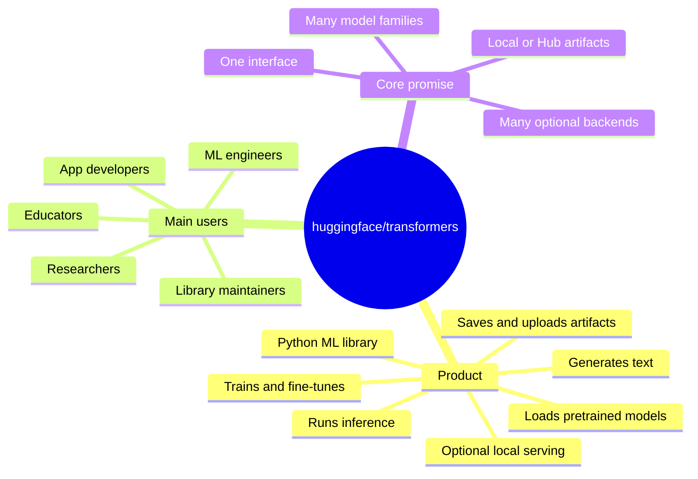

## 2. Top-Level Repository Map

```mermaid
flowchart TB
  Repo["huggingface_transformers"]

  Repo --> Src["src/transformers<br/>installed runtime package"]
  Repo --> Tests["tests<br/>quality and regression suite"]
  Repo --> Docs["docs<br/>user and contributor documentation"]
  Repo --> Examples["examples<br/>runnable recipes"]
  Repo --> Utils["utils<br/>repo checks and generators"]
  Repo --> Github[".github<br/>GitHub Actions and templates"]
  Repo --> Docker["docker<br/>reproducible environments"]
  Repo --> Bench["benchmark + benchmark_v2<br/>performance labs"]
  Repo --> I18n["i18n<br/>docs localization"]
  Repo --> AI[".ai + AGENTS.md<br/>contributor and agent instructions"]
  Repo --> Build["setup.py + pyproject.toml + Makefile<br/>build and tooling surface"]

  classDef central fill:#d9f0ff,stroke:#1976d2,color:#111;
  classDef support fill:#f7f7f7,stroke:#777,color:#111;
  classDef docs fill:#fff3cd,stroke:#b8860b,color:#111;

  class Src,Tests central;
  class Docs,Examples docs;
  class Utils,Github,Docker,Bench,I18n,AI,Build support;
```

## 3. Runtime Subsystem Map

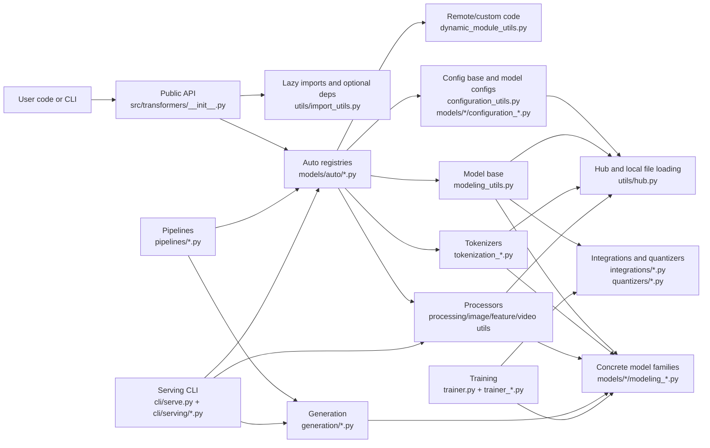

## 4. Core Layered Architecture

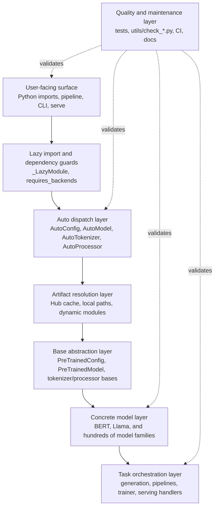

## 5. Main Dependency Direction

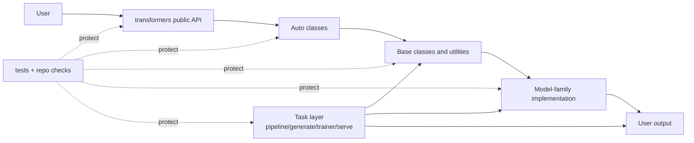

## 6. Public Import Flow

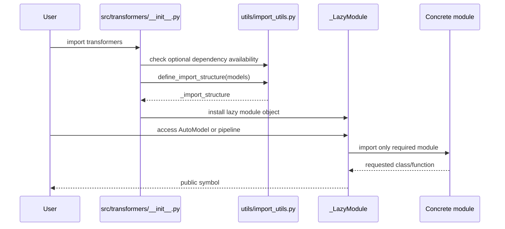

## 7. `AutoConfig.from_pretrained` Flow

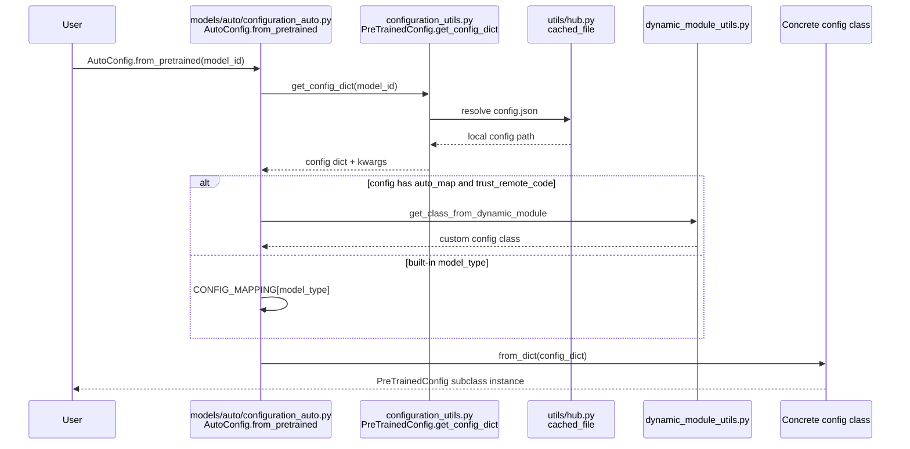

## 8. `AutoModel.from_pretrained` Flow

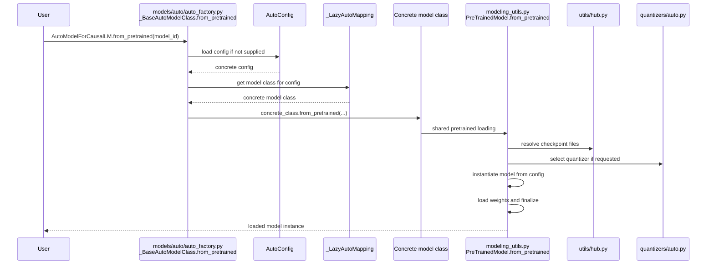

## 9. Artifact Loading Model

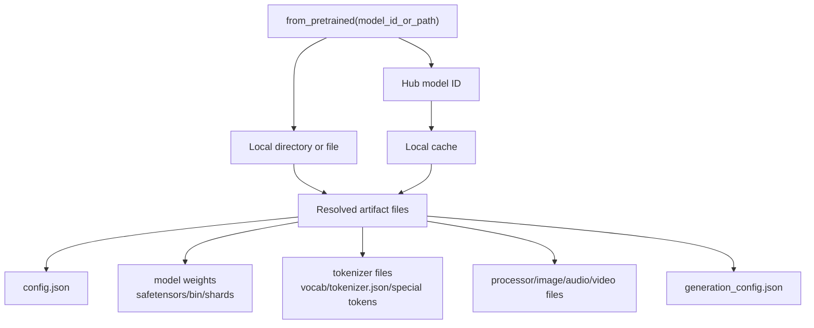

## 10. Pipeline Construction And Execution

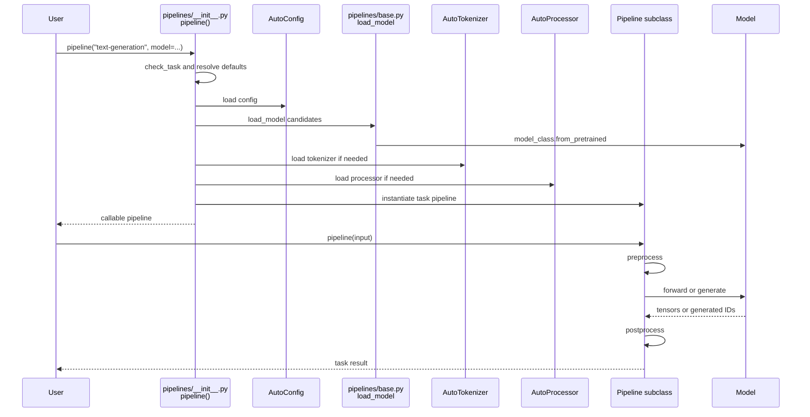

## 11. Generation Flow

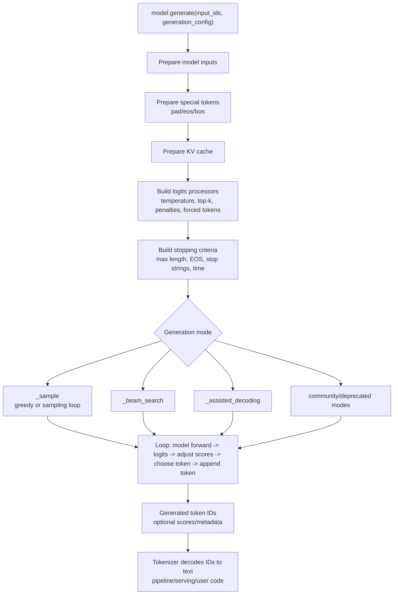

## 12. Training Flow

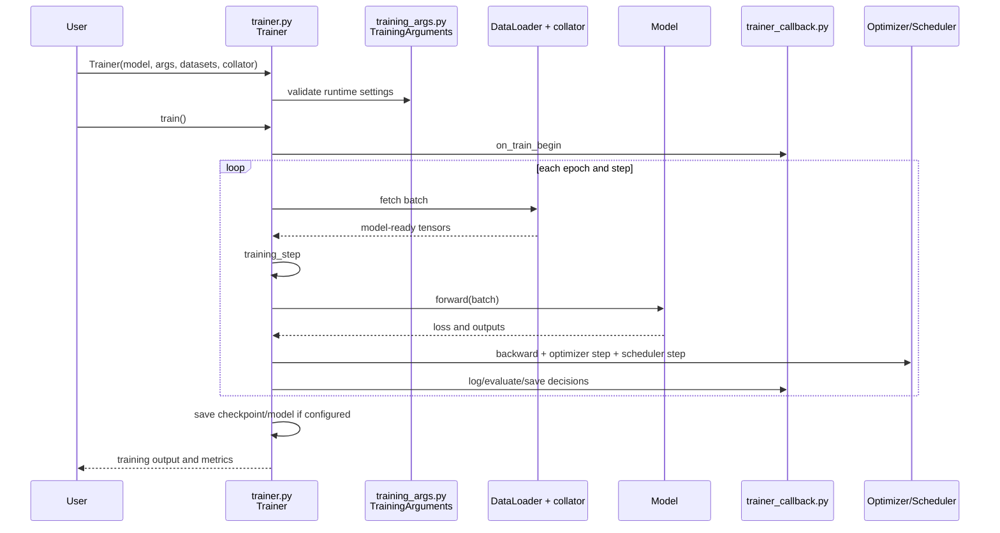

## 13. Serving Flow

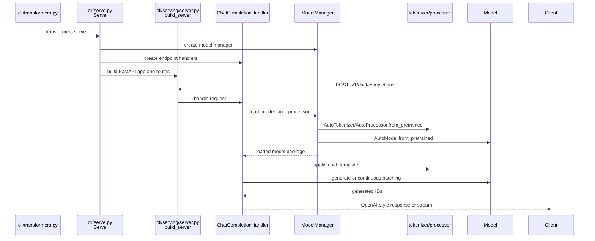

## 14. Continuous Batching Flow

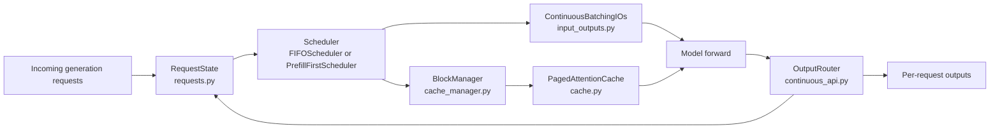

## 15. Model Family File Pattern

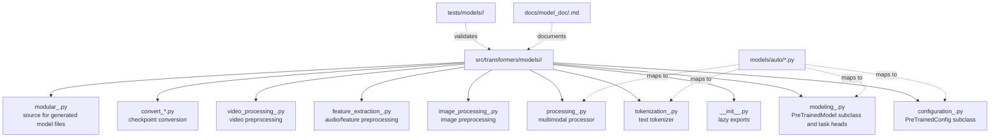

## 16. BERT Example Structure

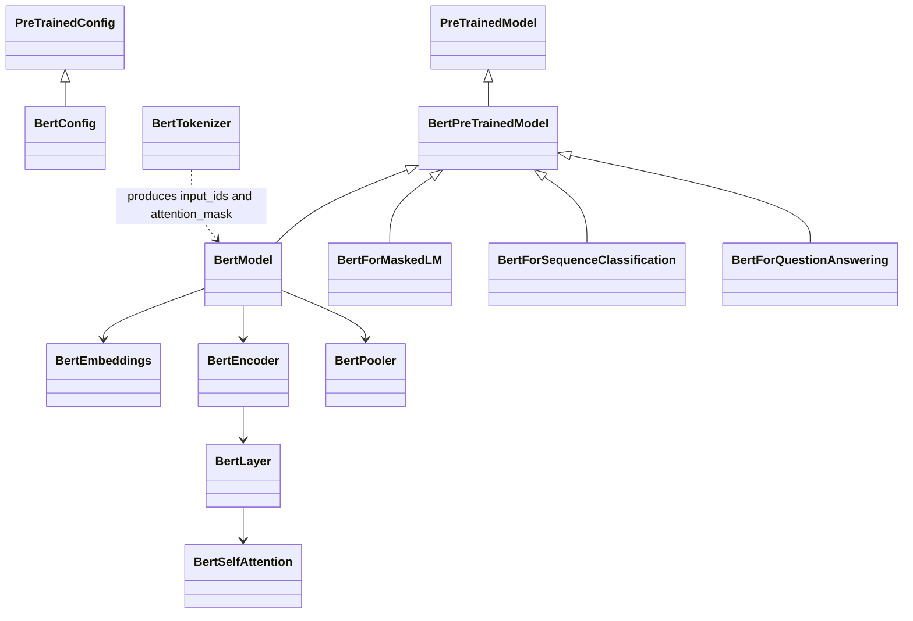

## 17. Llama Example Structure

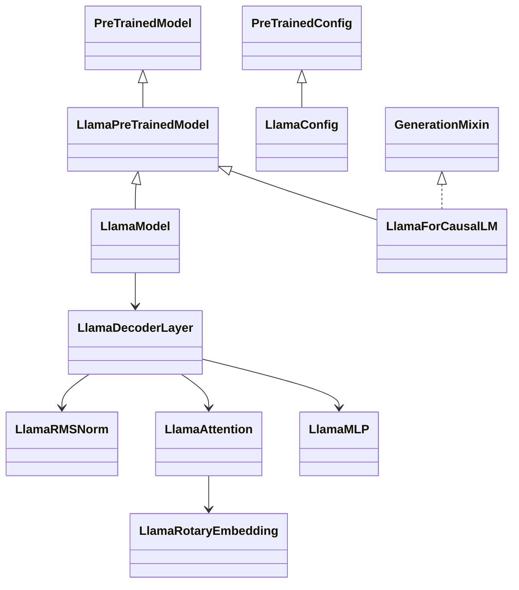

## 18. Configuration Types

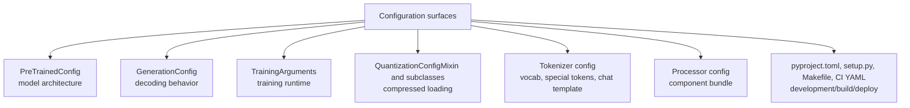

## 19. Optional Dependencies And Fallbacks

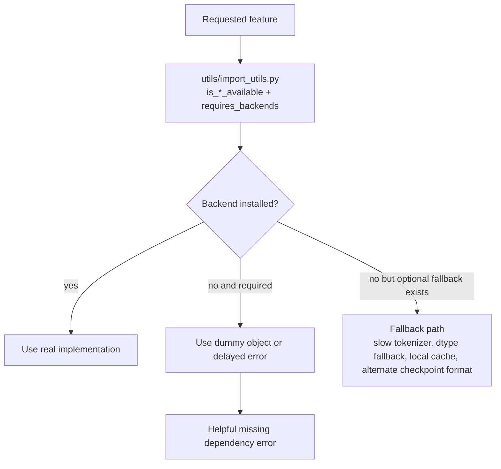

## 20. Repository Maintenance Flow

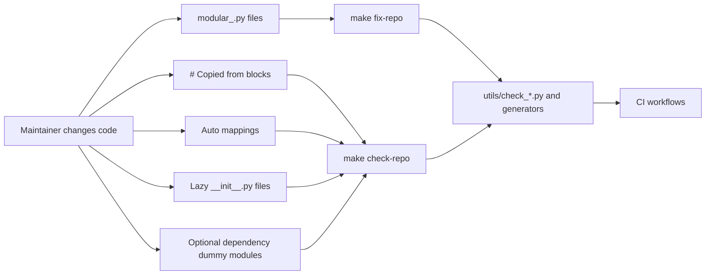

## 21. Testing Strategy Map

```mermaid
flowchart TB
  Tests["tests/"]
  Common["Common mixins<br/>test_modeling_common.py<br/>test_tokenization_common.py<br/>test_processing_common.py"]
  ModelTests["tests/models/**<br/>per-family tests"]
  GenerationTests["tests/generation/**"]
  PipelineTests["tests/pipelines/**"]
  TrainerTests["tests/trainer/**"]
  QuantTests["tests/quantization/**"]
  UtilsTests["tests/utils/**"]
  Fixtures["tests/fixtures/**"]
  Runtime["src/transformers runtime"]

  Tests --> Common
  Tests --> ModelTests
  Tests --> GenerationTests
  Tests --> PipelineTests
  Tests --> TrainerTests
  Tests --> QuantTests
  Tests --> UtilsTests
  Tests --> Fixtures

  Common -. shared expectations .-> ModelTests
  Fixtures -. sample artifacts .-> ModelTests
  ModelTests -. validate .-> Runtime
  GenerationTests -. validate .-> Runtime
  PipelineTests -. validate .-> Runtime
  TrainerTests -. validate .-> Runtime
  QuantTests -. validate .-> Runtime
  UtilsTests -. validate .-> Runtime
```

## 22. Quality And Risk Map

```mermaid
mindmap
  root((Quality assessment))
    Strengths
      Mature Auto APIs
      Lazy import infrastructure
      Consistent from_pretrained contract
      Hub integration
      Broad tests
      Repo consistency tooling
      Explicit model-family files
    Complexity hotspots
      modeling_utils.py
      trainer.py
      optional dependency matrix
      auto mapping drift
      generated and copied code
      serving plus continuous batching
    Risks
      hidden fallback paths
      trust_remote_code security
      weak central generation observability
      prompt template behavior distributed across artifacts
      expensive full CI matrix
      high onboarding cost
```

## 23. Best Study Order

```mermaid
flowchart TB
  A["1. README.md<br/>product intent"]
  B["2. setup.py + pyproject.toml<br/>packaging and tooling"]
  C["3. src/transformers/__init__.py<br/>public API"]
  D["4. utils/import_utils.py<br/>lazy imports"]
  E["5. AutoConfig.from_pretrained<br/>config dispatch"]
  F["6. _BaseAutoModelClass.from_pretrained<br/>model dispatch"]
  G["7. PreTrainedConfig<br/>config load/save"]
  H["8. PreTrainedModel.from_pretrained<br/>weight loading"]
  I["9. AutoTokenizer / AutoProcessor<br/>input translation"]
  J["10. One model family<br/>BERT or Llama"]
  K["11. generation/utils.py<br/>generate"]
  L["12. pipelines<br/>task factory and lifecycle"]
  M["13. trainer.py<br/>training"]
  N["14. utils/hub.py + dynamic_module_utils.py<br/>artifacts and custom code"]
  O["15. tests + utils/check_*.py<br/>contribution safety"]

  A --> B --> C --> D --> E --> F --> G --> H --> I --> J --> K --> L --> M --> N --> O
```

## 24. Debugging Orientation

```mermaid
flowchart TB
  Symptom{"What broke?"}

  Import["Import error"]
  LoadConfig["Config load error"]
  LoadModel["Model load error"]
  Tokenization["Bad input tokens or chat prompt"]
  GenerationBad["Bad or stuck generation"]
  PipelineBad["Pipeline task mismatch"]
  TrainBad["Training failure"]
  ServeBad["Serving/API failure"]

  Symptom --> Import
  Symptom --> LoadConfig
  Symptom --> LoadModel
  Symptom --> Tokenization
  Symptom --> GenerationBad
  Symptom --> PipelineBad
  Symptom --> TrainBad
  Symptom --> ServeBad

  Import --> ImportUtils["Check utils/import_utils.py<br/>optional deps and lazy imports"]
  LoadConfig --> ConfigAuto["Check configuration_auto.py<br/>model_type, auto_map, config.json"]
  LoadModel --> ModelingUtils["Check auto_factory.py + modeling_utils.py<br/>checkpoint files, dtype, device map, quantization"]
  Tokenization --> TokenizerFiles["Check tokenization_auto.py + tokenization_utils_base.py<br/>special tokens, chat template, vocab"]
  GenerationBad --> GenFiles["Check generation/utils.py<br/>GenerationConfig, logits processors, stopping criteria"]
  PipelineBad --> PipelineFiles["Check pipelines/__init__.py + pipelines/base.py<br/>SUPPORTED_TASKS and processor/model class"]
  TrainBad --> TrainerFiles["Check trainer.py + training_args.py<br/>batch, labels, optimizer, callbacks"]
  ServeBad --> ServingFiles["Check cli/serve.py + cli/serving/*.py<br/>request schema, ModelManager, generation path"]
```
