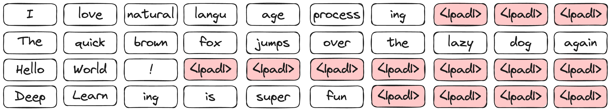
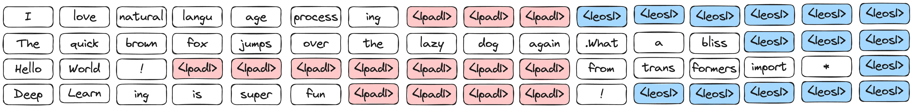
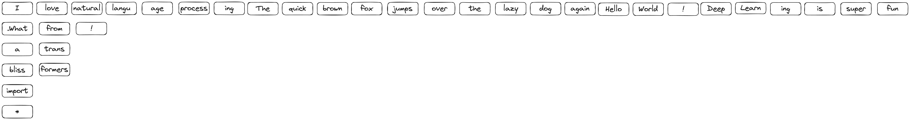
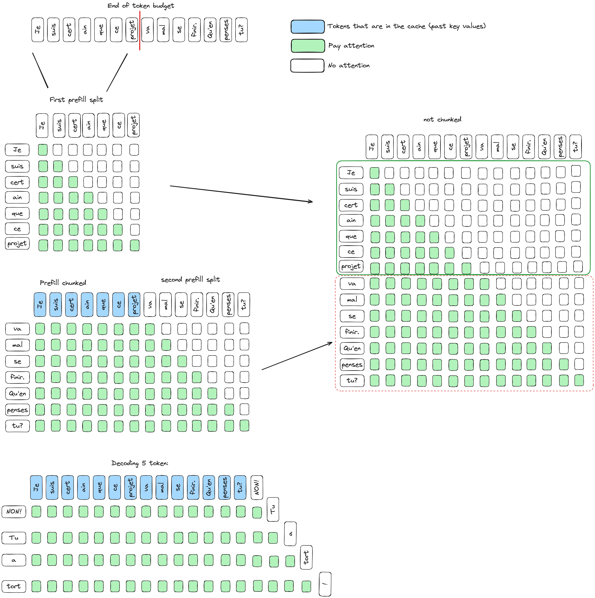

# Continious batching

## 1. Why should you use it? 
Continious Batching enables very fast model evalutation when you are training a model! It is based on (paged-attention)[https://arxiv.org/abs/2309.06180]. It allows you to not waste compute on `padding` tokens, by packing all of your requests. 

Continious Batching implements two main optimizations: 

### Ragged inputs
So instead of feeding the model with:

the model will receive: 

As you can 

### Dynamic Batching

When the model finishes generating and you are in a batched setting, we usually never remove that sequence from the batch. You would just wait for all requests to be done. Using the above exmaple: 

as you can see, the red + the blue tokens are all wasted. 

With CB:

## 2. How it works?

### Chunked prefill:
