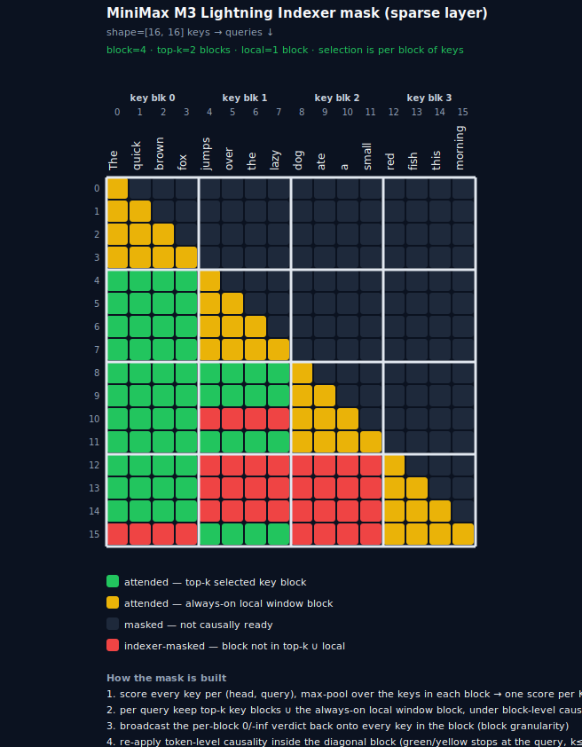

<!--Copyright 2026 the HuggingFace Team. All rights reserved.

Licensed under the Apache License, Version 2.0 (the "License");
you may not use this file except in compliance with the License.
You may obtain a copy of the License at

    http://www.apache.org/licenses/LICENSE-2.0

Unless required by applicable law or agreed to in writing, software
distributed under the License is distributed on an "AS IS" BASIS,
WITHOUT WARRANTIES OR CONDITIONS OF ANY KIND, either express or implied.
See the License for the specific language governing permissions and
limitations under the License.


⚠️ Note that this file is in Markdown but contain specific syntax for our doc-builder (similar to MDX) that may not be rendered properly in your Markdown viewer.

-->
*This model was contributed to Hugging Face Transformers on 2026-06-03.*


# MiniMax-M3-VL

## Overview

MiniMax-M3-VL is the vision-language member of the MiniMax-M3 family. It pairs a CLIP-style vision tower (Conv3d patch embedding with 3D rotary position embeddings) with the MiniMax-M3 text backbone, a mixed dense/sparse Mixture-of-Experts decoder that uses SwiGLU-OAI gated experts and a lightning indexer for block-sparse attention.

## Architecture
### Mixed dense/sparse MoE decoder

`config.moe_layer_freq[i]` selects layer `i`'s MLP:

* `0` — a dense [`MiniMaxM3VLDenseMLP`] at `dense_intermediate_size`.
* `1` — a sparse [`MiniMaxM3VLSparseMoeBlock`]: a [`MiniMaxM3VLTopKRouter`] routes the top-`num_experts_per_tok`
  of `num_local_experts` experts, scaled by `routed_scaling_factor`, with a single shared expert
  (`n_shared_experts` at `shared_intermediate_size`) running on every token in parallel.

The router scores experts with **`sigmoid`** (vs usually softmax) and adds an auxiliary-loss-free `e_score_correction_bias`
*before* the top-k argmax, so the bias steers *which* experts are chosen without flowing gradients. The chosen experts' sigmoid weights are then renormalized to sum to 1. Both dense and routed experts use the **SwiGLU-OAI** activation:

```python
gate = gate.clamp(max=swiglu_limit)
up = up.clamp(min=-swiglu_limit, max=swiglu_limit)
out = (up + 1.0) * (gate * torch.sigmoid(gate * swiglu_alpha))  # swiglu_alpha=1.702, swiglu_limit=7.0
```

### Block-sparse attention (Lightning Indexer)

Every layer is GQA (`num_key_value_heads = 4`) with per-head QK-norm and **partial RoPE** on the first
`rotary_dim`. `config.layer_types[i]` then picks `"full_attention"` (dense causal) or
`"minimax_m3_sparse"`, where a [`MiniMaxM3VLIndexer`] decides, per query, which block of keys the main attention may see.

The indexer scores every key, then **max-poolsthose per-key scores into blocks of `index_block_size` keys**, so selection happens at the granularity of a *block
of keys*: per query it keeps the top-`index_topk_blocks` key blocks plus the always-on `index_local_blocks`
local-window block (under block-level causality), broadcasts the per-block `0`/`-inf` choice back onto every key in
the block. The result is a `[B, 1, S_q, S_k]` additive bias summed onto the causal mask. 
Theoretically this means that the attention is only computed over the selected blocks of keys, but `transformers` does not support the kernels that compute this efficiently! 
We are adding it to `kernels` asap!




### Vision tower

A [`MiniMaxM3VLVisionModel`]: a `Conv3d` patch embedding over flattened `[N_patches, C·T·P·P]` input, a stack of
CLIP-style encoder layers carrying a **3D rotary** position embedding (time / height / width bands). A [`MiniMaxM3VLPatchMerger`] groups
`spatial_merge_size²` patches into the channel dim before the 2-layer GELU [`MiniMaxM3VLMultiModalProjector`] maps vision features into the text hidden size.

## Usage examples

```python
from transformers import AutoModelForImageTextToText, AutoProcessor
from PIL import Image
import torch


model = AutoModelForImageTextToText.from_pretrained(
    "MiniMaxAI/MiniMax-M3-preview", dtype=torch.bfloat16, device_map="auto",
)
processor = AutoProcessor.from_pretrained("MiniMaxAI/MiniMax-M3-preview")

image = Image.new("RGB", (672, 672), (127, 127, 127))
messages = [
    {
        "role": "user",
        "content": [
            {"type": "image"},
            {"type": "text", "text": "Describe this image briefly."},
        ],
    }
]
text = processor.apply_chat_template(messages, add_generation_prompt=True, tokenize=False)
inputs = processor(images=[image], text=text, return_tensors="pt").to(model.device)

generated_ids = model.generate(**inputs, max_new_tokens=32, do_sample=False)
print(processor.batch_decode(generated_ids, skip_special_tokens=True)[0])
```

## MiniMaxM3VLConfig

[[autodoc]] MiniMaxM3VLConfig

## MiniMaxM3VLTextConfig

[[autodoc]] MiniMaxM3VLTextConfig

## MiniMaxM3VLVisionConfig

[[autodoc]] MiniMaxM3VLVisionConfig

## MiniMaxM3VLProcessor

[[autodoc]] MiniMaxM3VLProcessor

## MiniMaxM3VLImageProcessorFast

[[autodoc]] MiniMaxM3VLImageProcessorFast

## MiniMaxM3VLVideoProcessor

[[autodoc]] MiniMaxM3VLVideoProcessor

## MiniMaxM3VLVisionModel

[[autodoc]] MiniMaxM3VLVisionModel
    - forward

## MiniMaxM3VLTextModel

[[autodoc]] MiniMaxM3VLTextModel
    - forward

## MiniMaxM3VLModel

[[autodoc]] MiniMaxM3VLModel
    - forward

## MiniMaxM3VLForCausalLM

[[autodoc]] MiniMaxM3VLForCausalLM
    - forward

## MiniMaxM3VLForConditionalGeneration

[[autodoc]] MiniMaxM3VLForConditionalGeneration
    - forward
