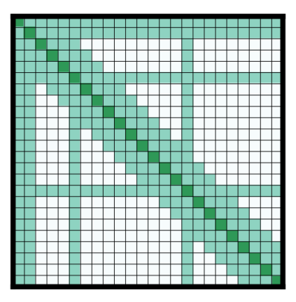

Summary of the models
================================================

This is a summary of the models available in the transformers library. It assumes you’re familiar with the original 
`transformer model <https://arxiv.org/abs/1706.03762>`_. For a gentle introduction check the `annotated transformer 
<http://nlp.seas.harvard.edu/2018/04/03/attention.html>`_. Here we focus on the high-level differences between the
models. You can check them more in detail in their respective documentation. Also checkout the 
:doc:`pretrained model page </pretrained_models>` to see the checkpoints available for each type of model and all `the 
community models <https://huggingface.co/models>`_.

Each one of the models in the library falls into one of the following categories:

  * :ref:`autoregressive-models`
  * :ref:`autoencoding-models`
  * :ref:`seq-to-seq-models`
  * :ref:`multimodal-models`

Autoregressive models are pretrained on the classic language modeling task: guess the next token having read all the 
previous ones. They correspond to the decoder of the original transformer model, and a mask is used on top of the full 
sentence so that the attention heads can only see what was before in the next, and not what’s after. Although those 
models can be fine-tuned and achieve great results on many tasks, the most natural application is text generation. 
A typical example of such models is GPT.

Autoencoding models are pretrained by corrupting the input tokens in some way and trying to reconstruct the original 
sentence. They correspond to the encoder of the original transformer model in the sense that they get access to the 
full inputs without any mask. Those models usually build a bidirectional representation of the whole sentence. They can 
be fine-tuned and achieve great results on many tasks such as text generation, but their most natural application is 
sentence classification or token classification. A typical example of such models is BERT.

Note that the only difference between autoregressive models and autoencoding models is in the way the model is 
pretrained. Therefore, the same architecture can be used for both autoregressive and autoencoding models. When a given
model has been used for both pretraining, we have put it in the category corresponding to the article it was first
introduced.

Sequence-to-sequence models use both the encoder and the decoder of the original transformer, either for translation 
tasks or by transforming other tasks to sequence-to-sequence problems. They can be fine-tuned to many tasks but their 
most natural applications are translation, summarization and question answering. The original transformer model is an 
example of such a model (only for translation), T5 is an example that can be fine-tuned on other tasks.

Multimodal models mix text inputs with other kinds (like image) and are more specific to a given task.

.. _autoregressive-models:

Autoregressive models
^^^^^^^^^^^^^^^^^^^^^^^^^^^^^^^^^^^^^^^^^^^^

As mentioned before, these models rely on the decoder part of the original transformer and use an attention mask so 
that at each position, the model can only look at the tokens before in the attention heads.

Original GPT
----------------------------------------------

.. raw:: html

   
   

`Improving Language Understanding by Generative Pre-Training <https://cdn.openai.com/research-covers/language-unsupervised/language_understanding_paper.pdf>`_, 
Alec Radford et al.

The first autoregressive model based on the transformer architecture, pretrained on the Book Corpus dataset.

The library provides versions of the model for language modeling and multitask language modeling/multiple choice 
classification.

GPT-2
----------------------------------------------

.. raw:: html

   
   

`Language Models are Unsupervised Multitask Learners <https://d4mucfpksywv.cloudfront.net/better-language-models/language_models_are_unsupervised_multitask_learners.pdf>`_, 
Alec Radford et al.

A bigger and better version of GPT, pretrained on WebText (web pages from outgoing links in Reddit with 3 karmas or 
more).

The library provides versions of the model for language modeling and multitask language modeling/multiple choice 
classification.

CTRL
----------------------------------------------

.. raw:: html

   
   

`CTRL: A Conditional Transformer Language Model for Controllable Generation <https://arxiv.org/abs/1909.05858>`_, 
Nitish Shirish Keskar et al.

Same as the GPT model but adds the idea of control codes. Text is generated from a prompt (can be empty) and one (or 
several) of those control codes which are then used to influence the text generation: generate with the style of 
wikipedia article, a book or a movie review.

The library provides a version of the model for language modeling only.

Transformer-XL
----------------------------------------------

.. raw:: html

   
   

`Transformer-XL: Attentive Language Models Beyond a Fixed-Length Context <https://arxiv.org/abs/1901.02860>`_, 
Zihang Dai et al.

Same as a regular GPT model, but introduces a recurrence mechanism for two consecutive segments (similar to a regular 
RNNs with two consecutive inputs). In this context, a segment is a number of consecutive tokens (for instance 512) that 
may span across multiple documents, and segments are fed in order to the model.

Basically, the hidden states of the previous segment are concatenated to the current input to compute the attention 
scores. This allows the model to pay attention to information that was in the previous segment as well as the current 
one. By stacking multiple attention layers, the receptive field can be increased to multiple previous segments.

This changes the positional embeddings to positional relative embeddings (as the regular positional embeddings would 
give the same results in the current input and the current hidden state at a given position) and needs to make some 
adjustments in the way attention scores are computed.

The library provides a version of the model for language modeling only.

.. _reformer:

Reformer
----------------------------------------------

.. raw:: html

   
   

`Reformer: The Efficient Transformer <https://arxiv.org/abs/2001.04451>`_,
Nikita Kitaev et al .

An autoregressive transformer model with lots of tricks to reduce memory footprint and compute time. Those tricks 
include:

  * Use :ref:`Axial position encoding <axial-pos-encoding>` (see below for more details). It’s a mechanism to avoid 
    having a huge positional encoding matrix (when the sequence length is very big) by factorizing it in smaller 
    matrices.
  * Replace traditional attention by :ref:`LSH (local-sensitive hashing) attention <lsh-attention>` (see below for more 
    details). It's a technique to avoid compute the full product query-key in the attention layers.
  * Avoid storing the intermediate results of each layer by using reversible transformer layers to obtain them during 
    the backward pass (subtracting the residuals from the input of the next layer gives them back) or recomputing them 
    for results inside a given layer (less efficient than storing them but saves memory).
  * Compute the feedforward operations by chunks and not on the whole batch.

With those tricks, the model can be fed much larger sentences than traditional transformer autoregressive models.

**Note:** This model could be very well be used in an autoencoding setting, there is no checkpoint for such a
pretraining yet, though.

The library provides a version of the model for language modeling only.

XLNet
----------------------------------------------

.. raw:: html

   
   

`XLNet: Generalized Autoregressive Pretraining for Language Understanding <https://arxiv.org/abs/1906.08237>`_,
Zhilin Yang et al.

XLNet is not a traditional autoregressive model but uses a training strategy that builds on that. It permutes the 
tokens in the sentence, then allows the model to use the last n tokens to predict the token n+1. Since this is all done 
with a mask, the sentence is actually fed in the model in the right order, but instead of masking the first n tokens 
for n+1, XLNet uses a mask that hides the previous tokens in some given permutation of 1,...,sequence length.

XLNet also uses the same recurrence mechanism as TransformerXL to build long-term dependencies. 

The library provides a version of the model for language modeling, token classification, sentence classification, 
multiple choice classification and question answering.

.. _autoencoding-models:

Autoencoding models
^^^^^^^^^^^^^^^^^^^^^^^^^^^^^^^^^^^^^^^^^^^^

As mentioned before, these models rely on the encoder part of the original transformer and use no mask so the model can
look at all the tokens in the attention heads. For pretraining, inputs are a corrupted version of the sentence, usually 
obtained by masking tokens, and targets are the original sentences.

BERT
----------------------------------------------

.. raw:: html

   
   

`BERT: Pre-training of Deep Bidirectional Transformers for Language Understanding <https://arxiv.org/abs/1810.04805>`_,
Jacob Devlin et al.

Corrupts the inputs by using random masking, more precisely, during pretraining, a given percentage of tokens (usually 
15%) are masked by
 
  * a special mask token with probability 0.8
  * a random token different from the one masked with probability 0.1
  * the same token with probability 0.1

The model must predict the original sentence, but has a second objective: inputs are two sentences A and B (with a 
separation token in between). With probability 50%, the sentences are consecutive in the corpus, in the remaining 50% 
they are not related. The model has to predict if the sentences are consecutive or not.

The library provides a version of the model for language modeling (traditional or masked), next sentence prediction, 
token classification, sentence classification, multiple choice classification and question answering.

ALBERT
----------------------------------------------

.. raw:: html

   
   

`ALBERT: A Lite BERT for Self-supervised Learning of Language Representations <https://arxiv.org/abs/1909.11942>`_,
Zhenzhong Lan et al.

Same as BERT but with a few tweaks:

  * Embedding size E is different from hidden size H justified because the embeddings are context independent (one 
    embedding vector represents one token) whereas hidden states are context dependent (one hidden state represents a 
    sequence of tokens) so it's more logical to have H >> E. Als, the embedding matrix is large since it's V x E (V 
    being the vocab size). If E < H, it has less parameters.
  * Layers are split in groups that share parameters (to save memory).
  * Next sentence prediction is replaced by a sentence ordering prediction: in the inputs, we have two sentences A et B 
    (that are consecutive) and we either feed A followed by B or B followed by A. The model must predict if they have 
    been swapped or not.

The library provides a version of the model for masked language modeling, token classification, sentence 
classification, multiple choice classification and question answering.

RoBERTa
----------------------------------------------

.. raw:: html

   
   

`RoBERTa: A Robustly Optimized BERT Pretraining Approach <https://arxiv.org/abs/1907.11692>`_,
Yinhan Liu et al.

Same as BERT with better pretraining tricks:

  * dynamic masking: tokens are masked differently at each epoch whereas BERT does it once and for all
  * no NSP (next sentence prediction) loss and instead of putting just two sentences together, put a chunk of 
    contiguous texts together to reach 512 tokens (so sentences in in an order than may span other several documents)
  * train with larger batches
  * use BPE with bytes as a subunit and not characters (because of unicode characters)

The library provides a version of the model for masked language modeling, token classification, sentence 
classification, multiple choice classification and question answering.

DistilBERT
----------------------------------------------

.. raw:: html

   
   

`DistilBERT, a distilled version of BERT: smaller, faster, cheaper and lighter <https://arxiv.org/abs/1910.01108>`_,
Victor Sanh et al.

Same as BERT but smaller. Trained by distillation of the pretrained BERT model, meaning it's been trained to predict 
the same probabilities as the larger model. The actual objective is a combination of:

  * finding the same probabilities as the teacher model
  * predicting the masked tokens correctly (but no next-sentence objective)
  * a cosine similarity between the hidden states of the student and the teacher model

The library provides a version of the model for masked language modeling, token classification, sentence classification 
and question answering.

XLM
----------------------------------------------

.. raw:: html

   
   

`Cross-lingual Language Model Pretraining <https://arxiv.org/abs/1901.07291>`_, Guillaume Lample and Alexis Conneau

A transformer model trained on several languages. There are three different type of training for this model and the 
library provides checkpoints for all of them:

  * Causal language modeling (CLM) which is the traditional autoregressive training (so this model could be in the 
    previous section as well). One of the languages is selected for each training sample, and the model input is a 
    sentence of 256 tokens that may span on several documents in one one those languages.
  * Masked language modeling (MLM) which is like RoBERTa. One of the languages is selected for each training sample, 
    and the model input is a sentence of 256 tokens that may span on several documents in one one those languages, with
    dynamic masking of the tokens.
  * A combination of MLM and translation language modeling (TLM). This consists of concatenating a sentence in two 
    different languages, with random masking. To predict one of the masked token, the model can use both the 
    surrounding context in language 1 as well as the context given by language 2.

Checkpoints refer to which method was used for pretraining by having `clm`, `mlm` or `mlm-tlm` in their names. On top
of positional embeddings, the model has language embeddings. When training using MLM/CLM, this gives the model an
indication of the language used, and when training using MLM+TLM, an indication of which part of the input is in which
language.

The library provides a version of the model for language modeling, token classification, sentence classification and 
question answering.

XLM-RoBERTa
----------------------------------------------

.. raw:: html

   
   

`Unsupervised Cross-lingual Representation Learning at Scale <https://arxiv.org/abs/1911.02116>`_, Alexis Conneau et 
al.

Uses RoBERTa tricks on the XLM approach, but does not use the translation language modeling objective, only using 
masked language modeling on sentences coming from one language. However, the model is trained on many more languages 
(100) and doesn't use the language embeddings, so it's capable of detecting the input language by itself.

The library provides a version of the model for masked language modeling, token classification, sentence 
classification, multiple choice classification and question answering.

FlauBERT
----------------------------------------------

.. raw:: html

   
   

`FlauBERT: Unsupervised Language Model Pre-training for French <https://arxiv.org/abs/1912.05372>`_, Hang Le et al.

Like RoBERTa, without the sentence ordering prediction (so just trained on the MLM objective).

The library provides a version of the model for language modeling and sentence classification.

ELECTRA
----------------------------------------------

.. raw:: html

   
   

`ELECTRA: Pre-training Text Encoders as Discriminators Rather Than Generators <https://arxiv.org/abs/2003.10555>`_, 
Kevin Clark et al.

ELECTRA is a transformer model pretrained with the use of another (small) masked language model. The inputs are 
corrupted by that language model, which takes an input text that is randomly masked and outputs a text in which ELECTRA 
has to predict which token is an original and which one has been replaced. Like for GAN training, the small language 
model is trained for a few steps (but with the original texts as objective, not to fool the ELECTRA model like in a 
traditional GAN setting) then the ELECTRA model is trained for a few steps.

The library provides a version of the model for masked language modeling, token classification and sentence 
classification.

.. _longformer:

Longformer
----------------------------------------------

.. raw:: html

   
   

`Longformer: The Long-Document Transformer <https://arxiv.org/abs/2004.05150>`_, Iz Beltagy et al.

A transformer model replacing the attention matrices by sparse matrices to go faster. Often, the local context (e.g., 
what are the two tokens left and right?) is enough to take action for a given token. Some preselected input tokens are 
still given global attention, but the attention matrix has way less parameters, resulting in a speed-up. See the 
:ref:`local attention section <local-attention>` for more information.

It is pretrained the same way a RoBERTa otherwise.

**Note:** This model could be very well be used in an autoregressive setting, there is no checkpoint for such a
pretraining yet, though.

The library provides a version of the model for masked language modeling, token classification, sentence 
classification, multiple choice classification and question answering.

.. _seq-to-seq-models:

Sequence-to-sequence models
^^^^^^^^^^^^^^^^^^^^^^^^^^^^^^^^^^^^^^^^^^^^

As mentioned before, these models keep both the encoder and the decoder of the original transformer.

BART
----------------------------------------------

.. raw:: html

   
   

`BART: Denoising Sequence-to-Sequence Pre-training for Natural Language Generation, Translation, and Comprehension 
<https://arxiv.org/abs/1910.13461>`_, Mike Lewis et al.

Sequence-to-sequence model with an encoder and a decoder. Encoder is fed a corrupted version of the tokens, decoder is 
fed the tokens (but has a mask to hide the future words like a regular transformers decoder). For the encoder, on the 
pretraining tasks, a composition of the following transformations are applied:

  * mask random tokens (like in BERT)
  * delete random tokens
  * mask a span of k tokens with a single mask token (a span of 0 tokens is an insertion of a mask token)
  * permute sentences
  * rotate the document to make it start by a specific token

The library provides a version of this model for conditional generation and sequence classification.

MarianMT
----------------------------------------------

.. raw:: html

   
   

`Marian: Fast Neural Machine Translation in C++ <https://arxiv.org/abs/1804.00344>`_, Marcin Junczys-Dowmunt et al.

A framework for translation models, using the same models as BART

The library provides a version of this model for conditional generation.

T5
----------------------------------------------

.. raw:: html

   
   

`Exploring the Limits of Transfer Learning with a Unified Text-to-Text Transformer <https://arxiv.org/abs/1910.10683>`_, 
Colin Raffel et al.

Uses the traditional transformer model (except a slight change with the positional embeddings, which are learned at 
each layer). To be able to operate on all NLP tasks, it transforms them in text-to-text problems by using certain 
prefixes: “Summarize: …”, “question: …”, “translate English to German: …” and so forth.

The pretraining includes both supervised and self-supervised training. Supervised training is conducted on downstream 
tasks provided by the GLUE and SuperGLUE benchmarks (changing them to text-to-text tasks as explained above).

Self-supervised training consists of corrupted pretrained, which means randomly removing 15% of the tokens and 
replacing them by individual sentinel tokens (if several consecutive tokens are marked for removal, they are replaced 
by one single sentinel token). The input of the encoder is the corrupted sentence, the input of the decoder the 
original sentence and the target is then the dropped out tokens delimited by their sentinel tokens.

For instance, if we have the sentence “My dog is very cute .”, and we decide to remove the token dog, is and cute, the 
input becomes “My <x> very <y> .” and the target is “<x> dog is <y> . <z>”

The library provides a version of this model for conditional generation.

.. _multimodal-models:

Multimodal models
^^^^^^^^^^^^^^^^^^^^^^^^^^^^^^^^^^^^^^^^^^^^

There is one multimodal model in the library which has not been pretrained in the self-supervised fashion like the 
others.

MMBT
----------------------------------------------

`Supervised Multimodal Bitransformers for Classifying Images and Text <https://arxiv.org/abs/1909.02950>`_, Douwe Kiela 
et al.

A transformers model used in multimodal settings, combining a text and an image to make predictions. The transformer 
model takes as inputs the embeddings of the tokenized text and a the final activations of a pretrained resnet on the 
images (after the pooling layer) that goes through a linear layer (to go from number of features at the end of the 
resnet to the hidden state dimension of the transformer).

The different inputs are concatenated, and on top of the positional embeddings, a segment embedding is added to let the 
model know which part of the input vector corresponds to the text or the image.

The pretrained model only works for classification.

..
    More information in this :doc:`model documentation </model_doc/mmbt>`.
    TODO: write this page

More technical aspects
^^^^^^^^^^^^^^^^^^^^^^^^^^^^^^^^^^^^^^^^^^^^

Full vs sparse attention
----------------------------------------------

Most transformer models use full attention in the sense that the attention matrix is square. It can be a big 
computational bottleneck when you have long texts. Longformer and reformer are models that try to be more efficient and 
use a sparse version of the attention matrix to speed up training.

.. _lsh-attention:

**LSH attention**

:ref:`Reformer <reformer>` uses LSH attention. In the softmax(QK^t), only the biggest elements (in the softmax 
dimension) of the matrix QK^t are going to give useful contributions. So for each query q in Q, we can only consider 
the keys k in K that are close to q. A hash function is used to determine if q and k are close. The attention mask is 
modified to mask the current token (except at the first position) because it will give a query and key equal (so very 
similar to each other). Since the hash can be a bit random, several hash functions are used in practice (determined by 
a n_rounds parameter) then are averaged together.

.. _local-attention:

**Local attention**

:ref:`Longformer <longformer>` uses local attention: often, the local context (e.g., what are the two tokens left and 
right?) is enough to take action for a given token. Also, by stacking attention layers that have a small window, the 
last layer will have a receptive field of more than just the tokens on the window, allowing them to build a 
representation of the whole sentence.

Some preselected input tokens are also given global attention: for those few tokens, the attention matrix can access 
all tokens and this process is symmetric: all other tokens have access to those specific tokens (on top of the ones in 
their local window). This is shown in Figure 2d of the paper, see below for a sample attention mask:

Using those attention matrices with less parameters then allows the model to have inputs having a bigger sequence 
length.

Other tricks
----------------------------------------------

.. _axial-pos-encoding:

**Axial positional encodings**

:ref:`Reformer <reformer>` uses axial positional encodings: in traditional transformer models, the positional encoding 
E is a matrix of size :math:`l` by :math:`d`, :math:`l` being the sequence length and :math:`d` the dimension of the 
hidden state. If you have very long texts, this matrix can be huge and take way too much space on the GPU.

To alleviate that, axial positional encodings consists in factorizing that big matrix E in two smaller matrices E1 and 
E2, with dimensions :math:`l_{1} \times d_{1}` and :math:`l_{2} \times d_{2}`, such that :math:`l_{1} \times l_{2} = l`
and :math:`d_{1} + d_{2} = d` (with the product for the lengths, this ends up being way smaller). The embedding for 
time step :math:`j` in E is obtained by concatenating the embeddings for timestep :math:`j \% l1` in E1 and 
:math:`j // l1` in E2.

