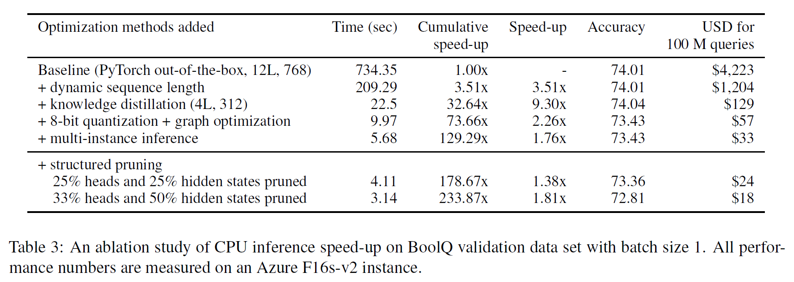

# FastFormers

**FastFormers** provides a set of recipes and methods to achieve highly efficient inference of Transformer models for Natural Language Understanding (NLU) including the demo models showing **233.87x speed-up** (Yes, 233x on CPU with the multi-head self-attentive Transformer architecture. This is not an LSTM or an RNN). The details of the methods and analyses are described in the paper *FastFormers: Highly Efficient Transformer Models for Natural Language Understanding* [paper](https://arxiv.org/abs/2010.13382).


### Notes

- With this repository, you can replicate the results presented in the *FastFormers* paper.
- The demo models of *FastFormers* are implemented with [SuperGLUE](https://super.gluebenchmark.com/) benchmark. Data processing pipeline is based on Alex Wang's implementation [reference code](https://github.com/W4ngatang/transformers/tree/superglue) for [SustaiNLP](https://sites.google.com/view/sustainlp2020/home) which is a fork from HuggingFace's [transformers](https://github.com/huggingface/transformers) repository. 
- This repository is built on top of several open source projects including [transformers](https://github.com/huggingface/transformers) from HuggingFace, [onnxruntime](https://github.com/Microsoft/onnxruntime), [transformers](https://github.com/W4ngatang/transformers/tree/superglue) from Alex Wang, [FBGEMM](https://github.com/pytorch/FBGEMM), [TinyBERT](https://github.com/huawei-noah/Pretrained-Language-Model/tree/master/TinyBERT) and etc.


## Requirements

- *FastFormers* currently only supports Linux operating systems.
- CPU requirements:
  * CPUs equipped with at least one, or both of `AVX2` and `AVX512` instruction sets are required. To get the full speed improvements and accuracy, `AVX512` instruction set is required. We have tested our runtime on Intel CPUs.
- GPU requirements:
  * To utilize 16-bit floating point speed-up, GPUs with Volta or later architectures are required.
- This repository utilizes a custom branch of [onnxruntime](https://github.com/Microsoft/onnxruntime), so any existing onnxruntime in your environment needs to be uninstalled before installing and utilizing this repository. We are trying to merge our customized code into the public main branch of onnxruntime.


## Installation

This repo is tested on Python 3.6 and 3.7, PyTorch 1.5.0+.

You need to uninstall pre-existing onnxruntime package as this repository uses customized versions of those.

You need to install PyTorch 1.5.0+. Then, execute following bash commands for Python 3.6. In case your environment has Python 3.7, please change the onnxruntime wheel file name to `onnxruntime-1.4.0-cp37-cp37m-linux_x86_64.whl` and do execute the same commands.


```bash
pip uninstall transformers -y
pip uninstall onnxruntime -y
git clone https://github.com/microsoft/fastformers
cd fastformers
pip install examples/fastformers/onnxruntime/onnxruntime-1.4.0-cp36-cp36m-linux_x86_64.whl --user
pip install .
```


## Run the demo systems

All the models used to benchmark Table 3 in the paper are publicly shared. You can use below commands to reproduce the results. Table 3 measurement was done on one of the Azure F16s_v2 instances.



The [installation step](#installation) needs to be done before proceeding.

0. Download [SuperGLUE](https://super.gluebenchmark.com/) dataset and decompress.

1. Download demo model files and decompress.
```bash
wget https://github.com/microsoft/fastformers/releases/download/v0.1-model/teacher-bert-base.tar.gz
wget https://github.com/microsoft/fastformers/releases/download/v0.1-model/student-4L-312.tar.gz
wget https://github.com/microsoft/fastformers/releases/download/v0.1-model/student-pruned-8h-600.tar.gz
wget https://github.com/microsoft/fastformers/releases/download/v0.1-model/student-pruned-9h-900.tar.gz
```

2. Run the teacher model (BERT-base) baseline
```bash
python3 examples/fastformers/run_superglue.py \
        --model_type bert --model_name_or_path ${teacher_model} \
        --task_name BoolQ --output_dir ${out_dir} --do_eval  \
        --data_dir ${data_dir} --per_instance_eval_batch_size 1 \
        --use_fixed_seq_length --do_lower_case --max_seq_length 512 \
        --no_cuda
```

3. Run the teacher model (BERT-base) with dynamic sequence length
```bash
python3 examples/fastformers/run_superglue.py \
        --model_type bert --model_name_or_path ${teacher_model} \
        --task_name BoolQ --output_dir ${out_dir} --do_eval  \
        --data_dir ${data_dir} --per_instance_eval_batch_size 1 \
        --do_lower_case --max_seq_length 512 --no_cuda
```

4. Run the distilled student model (PyTorch)
```bash
python3 examples/fastformers/run_superglue.py \
        --model_type bert --model_name_or_path ${student_model} \
        --task_name BoolQ --output_dir ${out_dir} --do_eval  \
        --data_dir ${data_dir} --per_instance_eval_batch_size 1 \
        --do_lower_case --max_seq_length 512 --no_cuda
```

5. Run the distilled student with 8-bit quantization (onnxruntime)
```bash
python3 examples/fastformers/run_superglue.py \
        --model_type bert --model_name_or_path ${student_model} \
        --task_name BoolQ --output_dir ${out_dir} --do_eval \
        --data_dir ${data_dir} --per_instance_eval_batch_size 1 \
        --do_lower_case --max_seq_length 512 --use_onnxrt --no_cuda
```

6. Run the distilled student with 8-bit quantization + multi-intance inference (onnxruntime)
```bash
OMP_NUM_THREADS=1 python3 examples/fastformers/run_superglue.py \
                          --model_type bert \
                          --model_name_or_path ${student_model} \
                          --task_name BoolQ --output_dir ${out_dir} --do_eval \
                          --data_dir ${data_dir} --per_instance_eval_batch_size 1 \
                          --do_lower_case --max_seq_length 512 --use_onnxrt \
                          --threads_per_instance 1 --no_cuda
```

7. Run the distilled + pruned student with 8-bit quantization + multi-intance inference (onnxruntime)
```bash
OMP_NUM_THREADS=1 python3 examples/fastformers/run_superglue.py \
                          --model_type bert \
                          --model_name_or_path ${pruned_student_model} \
                          --task_name BoolQ --output_dir ${out_dir} --do_eval \
                          --data_dir ${data_dir} --per_instance_eval_batch_size 1 \
                          --do_lower_case --max_seq_length 512 --use_onnxrt \
                          --threads_per_instance 1 --no_cuda
```


## How to create FastFormers

### Training models

This is used for fine-tuning of pretrained or general distilled model (*task-agnostic distillation*) to the downstream tasks.
Currently, BERT and RoBERTa models are supported.

*Tip 1.* This repository is based on transformers, so you can use huggingface's pre-trained models. (e.g. set `distilroberta-base` for --model_name_or_path to use [distilroberta-base](https://huggingface.co/distilroberta-base))

*Tip 2.* Before fine-tuning models, you can change the activation functions to **ReLU** to get better inference speed. To do this, you can download the config file of your model and manually change it to `relu` (`hidden_act` in case of BERT and ReBERTa models). Then, you can specify the config file by adding parameter (--config_name).

*Tip 3.* Depending on the task and the models used, you can add --do_lower_case if it give a better accuracy.

```bash
python3 examples/fastformers/run_superglue.py \
        --data_dir ${data_dir} --task_name ${task} \
        --output_dir ${out_dir} --model_type ${model_type} \
        --model_name_or_path ${model} \
        --use_gpuid ${gpuid} --seed ${seed} \
        --do_train --max_seq_length ${seq_len_train} \
        --do_eval --eval_and_save_steps ${eval_freq} --save_only_best \
        --learning_rate 0.00001 \
        --warmup_ratio 0.06 --weight_decay 0.01 \
        --per_gpu_train_batch_size 4 \
        --gradient_accumulation_steps 1 \
        --logging_steps 100 --num_train_epochs 10 \
        --overwrite_output_dir --per_instance_eval_batch_size 8
```

### Distilling models

This is used for distilling fine-tuned teacher models into smaller student models (*task-specific distillation*) on the downstream tasks. As described in the paper, it is critical to initialize student models with general distilled models such as *distilbert-*, *distilroberta-base* and *TinyBERT*.

This command is also used to distill non-pruned models into pruned models.

This command always uses task specific logit loss between teacher and student models for the student training. You can add addtional losses for hidden states (including token mbedding) and attentions between teacher and student. To use hidden states and attentions distillation, the number of teacher layers should be multiples of the number of student layers.

```bash
python3 examples/fastformers/run_superglue.py \
        --data_dir ${data_dir} --task_name ${task} \
        --output_dir ${out_dir} --teacher_model_type ${teacher_model_type} \
        --teacher_model_name_or_path ${teacher_model} \
        --model_type ${student_model_type} --model_name_or_path ${student_model} \
        --use_gpuid ${gpuid} --seed ${seed} \
        --do_train --max_seq_length ${seq_len_train} \
        --do_eval --eval_and_save_steps ${eval_freq} --save_only_best \
        --learning_rate 0.00001 \
        --warmup_ratio 0.06 --weight_decay 0.01 \
        --per_gpu_train_batch_size 4 \
        --gradient_accumulation_steps 1 \
        --logging_steps 100 --num_train_epochs 10 \
        --overwrite_output_dir --per_instance_eval_batch_size 8 \
        --state_loss_ratio 0.1
```

### Pruning models

This command performs structured pruning on the models described in the paper. It reduces the number of heads and the intermediate hidden states of FFN as set in the options. When the pruning is done on GPU, only 1 GPU is utilized (no multi-GPU).

To get better accuracy, you can do another round of knowledge distillation after the pruning.

```bash
python3 examples/fastformers/run_superglue.py \
        --data_dir ${data_dir} --task_name ${task} \
        --output_dir ${out_dir} --model_type ${model_type} \
        --model_name_or_path ${model} --do_eval \
        --do_prune --max_seq_length ${seq_len_train} \
        --per_instance_eval_batch_size 1 \
        --target_num_heads 8 --target_ffn_dim 600
```

### Optimizing models on CPU (8-bit integer quantization + onnxruntime)

This command convert your PyTorch transformers models into optimized onnx format with 8-bit quantization. The converted ONNX model is saved in the directory which the original PyTorch model is located.

```bash
python3 examples/fastformers/run_superglue.py \
        --task_name ${task} \
        --model_type ${model_type} \
        --model_name_or_path ${model} \
        --convert_onnx
```

### Optimizing models on GPU (16-bit floating point conversion)

This command convert your PyTorch transformers models into 16-bit floating point model (PyTorch). This creates a new directory named `fp16` in the directory the original model is located. Then, the converted fp16 model and all necessary files are saved to the directory.

```bash
python3 examples/fastformers/run_superglue.py \
        --task_name ${task} \
        --model_type ${model_type} \
        --model_name_or_path ${model} \
        --convert_fp16
```

### Evaluating models

This command evalutes various models with PyTorch or onnxruntime engine on the give tasks. For more detailed usage, please refer to the [demo section](#run-the-demo-systems).

```bash
OMP_NUM_THREADS=1 python3 examples/fastformers/run_superglue.py \
                          --model_type bert \
                          --model_name_or_path ${pruned_student_model} \
                          --task_name BoolQ --output_dir ${out_dir} --do_eval \
                          --data_dir ${data_dir} --per_instance_eval_batch_size 1 \
                          --do_lower_case --max_seq_length 512 --use_onnxrt \
                          --threads_per_instance 1 --no_cuda
```

## Code of Conduct

This project has adopted the [Microsoft Open Source Code of Conduct](https://opensource.microsoft.com/codeofconduct/).

## License

This project is licensed under the [MIT License](../../LICENSE).
