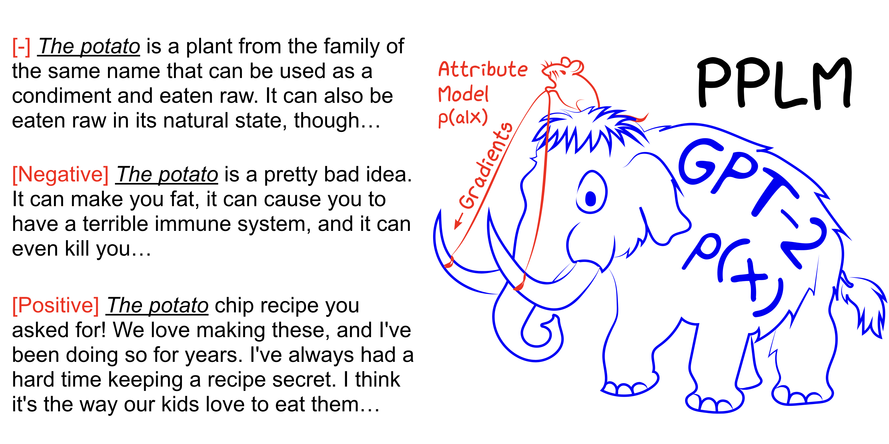

# PPLM

This folder contains the original code used to run the Plug and Play Language Model (PPLM).


## Plug and Play Language Models: a Simple Approach to Controlled Text Generation
Authors: [Sumanth Dathathri](https://dathath.github.io/), [Andrea Madotto](https://andreamad8.github.io/), Janice Lan, Jane Hung, Eric Frank, [Piero Molino](https://w4nderlu.st/), [Jason Yosinski](http://yosinski.com/), and [Rosanne Liu](http://www.rosanneliu.com/)

PPLM allows a user to flexibly plug in one or more tiny attribute models representing the desired steering objective into a large, unconditional language model (LM). The method has the key property that it uses the LM _as is_—no training or fine-tuning is required—which enables researchers to leverage best-in-class LMs even if they do not have the extensive hardware required to train them.

Paper link: 

Blog link: https://eng.uber.com/pplm


## Setup

```bash
git clone https://github.com/huggingface/transformers && cd transformers
pip install [--editable] .
pip install nltk torchtext # additional requirements.
cd examples/pplm
```

## PPLM-BoW 

### Example command for bag-of-words control

```bash
python run_pplm.py -B space --cond_text "The president" --length 100 --gamma 1.5 --num_iterations 3 --num_samples 1 --stepsize 0.01 --window_length 5 --kl_scale 0.01 --gm_scale 0.95
```

### Tuning hyperparameters for bag-of-words control

1. Increase `--stepsize` to intensify topic control, and decrease its value to soften the control. `--stepsize 0` recovers the original uncontrolled GPT-2 model. 

2. If the language being generated is repetitive (For e.g. "science science experiment experiment"), there are several options to consider: </br>
	a) Reduce the `--stepsize` </br>
	b) Increase `--kl_scale` (the KL-loss coefficient) or decrease `--gm_scale` (the gm-scaling term) </br>
	c) Add `--grad-length xx` where xx is an (integer <= length, e.g. `--grad-length 30`).</br>


## PPLM-Discrim

### Example command for discriminator based sentiment control

```bash
python run_pplm.py -D sentiment --class_label 2 --cond_text "My dog died" --length 50 --gamma 1.0 --num_iterations 10 --num_samples 1 --stepsize 0.03 --kl_scale 0.01 --gm_scale 0.95 --sample
```

### Tuning hyperparameters for discriminator control

1. Increase `--stepsize` to intensify topic control, and decrease its value to soften the control. `--stepsize 0` recovers the original uncontrolled GPT-2 model. 

2. Use `--class_label 3` for negative, and `--class_label 2` for positive

