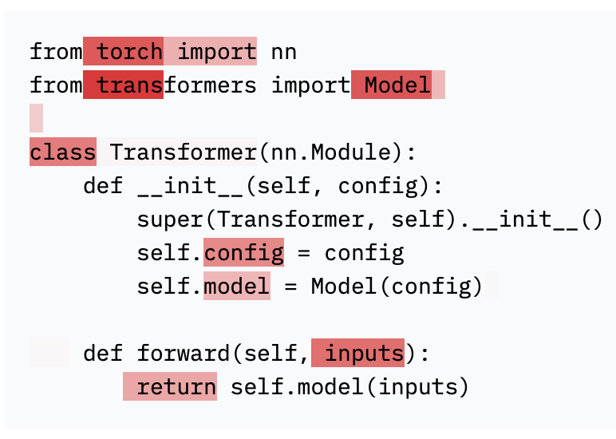

# CodeParrot 🦜
<p align="center">
    
</p>

## What is this about?
This is an open-source effort to train and evaluate code generation models. CodeParrot 🦜 is a GPT-2 model trained from scratch on Python code. The highlights of this repo are:
- initialize and train a GPT-2 language model from scratch for code generation
- clean and deduplicate a large (>100GB) dataset with `datasets`
- train with `accelerate` on multiple GPUs using data parallelism and mixed precision
- continuously push checkpoints to the hub with `huggingface_hub`
- stream the dataset with `datasets` during training to avoid disk bottlenecks
- apply `code_eval` metric in `datasets` to evaluate on OpenAI's HumanEval benchmark

## Installation
To install the dependencies simply run the following command:
```bash
pip install -r requirements.txt
```

## Dataset
The source of the dataset is the GitHub dump available on Google's [BigQuery](https://cloud.google.com/blog/topics/public-datasets/github-on-bigquery-analyze-all-the-open-source-code). The database was queried for all Python files resulting in a 180GB dataset with over 20M files. The dataset is available on the Hugging Face Hub [here](https://huggingface.co/datasets/transformersbook/codeparrot).

## Preprocessing
The raw dataset contains many duplications so the dataset was deduplicated and filtered using the heuristics proposed in the Codex [paper](https://arxiv.org/abs/2107.03374):

- exact deduplication
- filtering files with max line length > 1000
- filtering files with mean line length > 100
- fraction of alphanumeric characters < 0.25
- containing the word "auto-generated" or similar in the first 5 lines

The script to process the full dataset can be found in `scripts/preprocessing.py`. Executing the script on 16 CPUs takes roughly 3h and removes 70% of the original dataset. The cleaned [train](https://huggingface.co/datasets/lvwerra/codeparrot-clean-train) and [validation](https://huggingface.co/datasets/lvwerra/codeparrot-clean-valid) splits are also available on the Hub.

## Training
The models are randomly initialized and trained from scratch. The initialization script can be found at `scripts/initialize.py`. The main training script is built with 🤗 Accelerate to scale across a wide range of platforms and infrastructure scales.

We train two models with [110M](https://huggingface.co/lvwerra/codeparrot-small/) and [1.5B](https://huggingface.co/lvwerra/codeparrot/) parameters for 25-30B tokens on a 16xA100 (40GB) machine which takes 1 day and 1 week, respectively. The training script can be found in `scripts/codeparrot_training.py`.

## Evaluation
The validation loss can be calculate with the `scripts/validation_loss.py` script. In addition we evaluate the model on OpenAI's _HumanEval_ benchmark. The evaluation script can be found in `scripts/human_eval.py`. The results as well as reference values are shown in the following table:

| Model | pass@1 | pass@10 | pass@100|
|-------|--------|---------|---------|
|CodeParrot 🦜 (110M) | 3.80% | 6.57% | 12.78% |
|CodeParrot 🦜 (1.5B) | 3.58% | 8.03% | 14.96% |
|||||
|Codex (25M)| 3.21% | 7.1% |	12.89%|
|Codex (85M)| 8.22%	| 12.81% | 22.40% |
|Codex (300M)| 13.17%| 20.37% | 36.27% |
|Codex (12B)| 28.81%| 46.81% | 72.31% |
|||||
|GPT-neo (125M)| 0.75% | 1.88% | 2.97% |
|GPT-neo (1.5B)| 4.79% | 7.47% | 16.30% |
|GPT-neo (2.7B)| 6.41% | 11.27% | 21.37% |
|GPT-J (6B)| 11.62% | 15.74% | 27.74% |

Both CodeParrot 🦜 models are still underfitted and longer training would likely improve the performance, especially for the large model.

## Demo
Give the model a shot yourself! There are two demos to interact with the model:
- [Code generation](https://huggingface.co/spaces/lvwerra/codeparrot-generation)
- [Code highlighting](https://huggingface.co/spaces/lvwerra/codeparrot-highlighting)

## Further Resources
A detailed description of the project can be found in the chapter "Training Transformers from Scratch" in the upcoming O'Reilly book [Natural Language Processing with Transformers](https://learning.oreilly.com/library/view/natural-language-processing/9781098103231/).