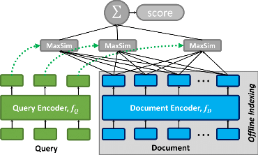

# ColBERT (v2)

### ColBERT is a _fast_ and _accurate_ retrieval model, enabling scalable BERT-based search over large text collections in tens of milliseconds.


<p align="center">
  
</p>
<p align="center">
  <b>Figure 1:</b> ColBERT's late interaction, efficiently scoring the fine-grained similarity between a queries and a passage.
</p>

As Figure 1 illustrates, ColBERT relies on fine-grained **contextual late interaction**: it encodes each passage into a **matrix** of token-level embeddings (shown above in blue). Then at search time, it embeds every query into another matrix (shown in green) and efficiently finds passages that contextually match the query using scalable vector-similarity (`MaxSim`) operators.

These rich interactions allow ColBERT to surpass the quality of _single-vector_ representation models, while scaling efficiently to large corpora. You can read more in our papers:

* [**ColBERT: Efficient and Effective Passage Search via Contextualized Late Interaction over BERT**](https://arxiv.org/abs/2004.12832) (SIGIR'20).
* [**Relevance-guided Supervision for OpenQA with ColBERT**](https://arxiv.org/abs/2007.00814) (TACL'21).
* [**Baleen: Robust Multi-Hop Reasoning at Scale via Condensed Retrieval**](https://arxiv.org/abs/2101.00436) (NeurIPS'21).
* [**ColBERTv2: Effective and Efficient Retrieval via Lightweight Late Interaction**](https://arxiv.org/abs/2112.01488) (NAACL'22).
* [**PLAID: An Efficient Engine for Late Interaction Retrieval**](https://arxiv.org/abs/2205.09707) (CIKM'22).

----

## ColBERTv1

The ColBERTv1 code from the SIGIR'20 paper is in the [`colbertv1` branch](https://github.com/stanford-futuredata/ColBERT/tree/colbertv1). See [here](#branches) for more information on other branches.


## Installation

ColBERT requires Python 3.7+ and Pytorch 1.9+ and uses the [HuggingFace Transformers](https://github.com/huggingface/transformers) library.

We strongly recommend creating a conda environment using the commands below. (If you don't have conda, follow the official [conda installation guide](https://docs.anaconda.com/anaconda/install/linux/#installation).)

We have also included a new environment file specifically for CPU-only environments (`conda_env_cpu.yml`), but note that if you are testing CPU execution on a machine that includes GPUs you might need to specify `CUDA_VISIBLE_DEVICES=""` as part of your command. Note that a GPU is required for training and indexing.

```
conda env create -f conda_env[_cpu].yml
conda activate colbert
```

If you face any problems, please [open a new issue](https://github.com/stanford-futuredata/ColBERT/issues) and we'll help you promptly!


## Overview

Using ColBERT on a dataset typically involves the following steps.

**Step 0: Preprocess your collection.** At its simplest, ColBERT works with tab-separated (TSV) files: a file (e.g., `collection.tsv`) will contain all passages and another (e.g., `queries.tsv`) will contain a set of queries for searching the collection.

**Step 1: Download the [pre-trained ColBERTv2 checkpoint](https://downloads.cs.stanford.edu/nlp/data/colbert/colbertv2/colbertv2.0.tar.gz).** This checkpoint has been trained on the MS MARCO Passage Ranking task. You can also _optionally_ [train your own ColBERT model](#training).

**Step 2: Index your collection.** Once you have a trained ColBERT model, you need to [index your collection](#indexing) to permit fast retrieval. This step encodes all passages into matrices, stores them on disk, and builds data structures for efficient search.

**Step 3: Search the collection with your queries.** Given the model and index, you can [issue queries over the collection](#retrieval) to retrieve the top-k passages for each query.

Below, we illustrate these steps via an example run on the MS MARCO Passage Ranking task.


## API Usage Notebook

This Jupyter notebook **[docs/intro.ipynb notebook](docs/intro.ipynb)** illustrates using the key features of ColBERT with the new Python API.

It includes how to download the ColBERTv2 model checkpoint trained on MS MARCO Passage Ranking and how to download our new LoTTE benchmark.


## Data

This repository works directly with a simple **tab-separated file** format to store queries, passages, and top-k ranked lists.


* Queries: each line is `qid \t query text`.
* Collection: each line is `pid \t passage text`.
* Top-k Ranking: each line is `qid \t pid \t rank`.

This works directly with the data format of the [MS MARCO Passage Ranking](https://github.com/microsoft/MSMARCO-Passage-Ranking) dataset. You will need the training triples (`triples.train.small.tar.gz`), the official top-1000 ranked lists for the dev set queries (`top1000.dev`), and the dev set relevant passages (`qrels.dev.small.tsv`). For indexing the full collection, you will also need the list of passages (`collection.tar.gz`).


## Indexing

For fast retrieval, indexing precomputes the ColBERT representations of passages.

Example usage:

```
from colbert.infra import Run, RunConfig, ColBERTConfig
from colbert import Indexer

if __name__=='__main__':
    with Run().context(RunConfig(nranks=1, experiment="msmarco")):

        config = ColBERTConfig(
            nbits=2,
            root="/path/to/experiments",
        )
        indexer = Indexer(checkpoint="/path/to/checkpoint", config=config)
        indexer.index(name="msmarco.nbits=2", collection="/path/to/MSMARCO/collection.tsv")
```


## Retrieval

We typically recommend that you use ColBERT for **end-to-end** retrieval, where it directly finds its top-k passages from the full collection:

```
from colbert.data import Queries
from colbert.infra import Run, RunConfig, ColBERTConfig
from colbert import Searcher

if __name__=='__main__':
    with Run().context(RunConfig(nranks=1, experiment="msmarco")):

        config = ColBERTConfig(
            root="/path/to/experiments",
        )
        searcher = Searcher(index="msmarco.nbits=2", config=config)
        queries = Queries("/path/to/MSMARCO/queries.dev.small.tsv")
        ranking = searcher.search_all(queries, k=100)
        ranking.save("msmarco.nbits=2.ranking.tsv")
```

You can optionally specify the `ncells`, `centroid_score_threshold`, and `ndocs` search hyperparameters to trade off between speed and result quality. Defaults for different values of `k` are listed in colbert/searcher.py.

We can evaluate the MSMARCO rankings using the following command:

```
python -m utility.evaluate.msmarco_passages --ranking "/path/to/msmarco.nbits=2.ranking.tsv" --qrels "/path/to/MSMARCO/qrels.dev.small.tsv"
```

## Training

We provide a [pre-trained model checkpoint](https://downloads.cs.stanford.edu/nlp/data/colbert/colbertv2/colbertv2.0.tar.gz), but we also detail how to train from scratch here.
Note that this example demonstrates the ColBERTv1 style of training, but the provided checkpoint was trained with ColBERTv2.

Training requires a JSONL triples file with a `[qid, pid+, pid-]` list per line. The query IDs and passage IDs correspond to the specified `queries.tsv` and `collection.tsv` files respectively.

Example usage (training on 4 GPUs):

```
from colbert.infra import Run, RunConfig, ColBERTConfig
from colbert import Trainer

if __name__=='__main__':
    with Run().context(RunConfig(nranks=4, experiment="msmarco")):

        config = ColBERTConfig(
            bsize=32,
            root="/path/to/experiments",
        )
        trainer = Trainer(
            triples="/path/to/MSMARCO/triples.train.small.tsv",
            queries="/path/to/MSMARCO/queries.train.small.tsv",
            collection="/path/to/MSMARCO/collection.tsv",
            config=config,
        )

        checkpoint_path = trainer.train()

        print(f"Saved checkpoint to {checkpoint_path}...")
```

## Branches

### Supported branches

* [`main`](https://github.com/stanford-futuredata/ColBERT/tree/main): Stable branch with ColBERTv2 + PLAID.
* [`colbertv1`](https://github.com/stanford-futuredata/ColBERT/tree/colbertv1): Legacy branch for ColBERTv1.

### Deprecated branches
* [`new_api`](https://github.com/stanford-futuredata/ColBERT/tree/new_api): Base ColBERTv2 implementation.
* [`cpu_inference`](https://github.com/stanford-futuredata/ColBERT/tree/cpu_inference): ColBERTv2 implementation with CPU search support.
* [`fast_search`](https://github.com/stanford-futuredata/ColBERT/tree/fast_search): ColBERTv2 implementation with PLAID.
* [`binarization`](https://github.com/stanford-futuredata/ColBERT/tree/binarization): ColBERT with a baseline binarization-based compression strategy (as opposed to ColBERTv2's residual compression, which we found to be more robust).
