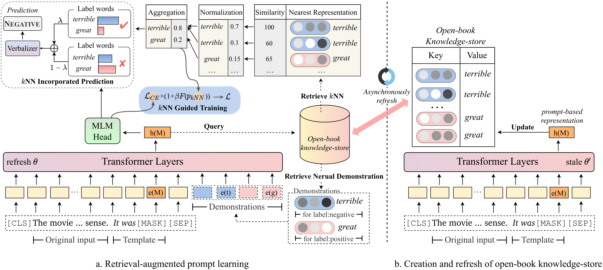

# RETROPROMPT

Code for the NeurIPS 2022 paper "[Decoupling Knowledge from Memorization:
Retrieval-augmented Prompt Learning](https://arxiv.org/pdf/2205.14704.pdf)".

## Quick links

* [Overview](#overview)
* [Requirements](#requirements)
* [Data Preparation](#data-preparation)
* [Training](#training)
* [Citation](#citation)

## Overview

The architecture of our model can be seen as follows:

<div align=center>
s
</div>

RETROPROMPT is a simple and general retrieval-augmented framework for prompt learning,  whose basis is the dense retriever with an open-book knowledge-store to decouple knowledge from memorization. RETROPROMPT consists of three components: retrieval of neural demonstration for enhancing input, the kNN guided training and the kNN-based probability for cloze-style prediction.

> 📋 Note: There are two main file folders in our project. The folder `GLUE_task` includes three single sentence tasks (SST-2, MR, CR), three sentence pair
classification tasks (MNLI, QNLI, QQP) and one information extraction task (Few-NERD), and the folder `RE_task` includes two information extraction tasks (SemEval, TACRED).

## Requirements

The environmental requirements are placed in `GLUE_task` and `RE_task` respectively.

```setup
pip install -r requirements.txt
```
There are some differences between the environmental requirements of GLUE task and RE task: 
- The version of `transformers` in the GLUE task is 4.11.3, while the version of `transformers` in the RE task is 4.7.
- GLUE task based on the `transformers` framework from huggingface , RE task based on the `pytorch_lightning` framework.


## Data Preparation


### 1. Generate GLUE data

Download the original datasets (Few-NERD, SST-2, MR, CR, MNLI, QNLI, QQP, RTE, MPQA) from [here](https://nlp.cs.princeton.edu/projects/lm-bff/datasets.tar). We take `k=16` or `k=4` and 5 different seeds includes `13, 21, 42, 87, 100` in few-shot learning. You can run the following command to generate the few-shot data of GLUE tasks. Then the generated data will be placed in `data/training_data/k_shot`:
```bash
# take SST-2 and 16-shot as example
cd GLUE_task
python tools/generate_k_shot_data.py --k 16 --task SST-2
```

### 2. Generate RE data

#### 2.1 Initialize the answer words
Using the command below to get the answer words to use in the training.
```bash
cd RE_task
python get_label_word.py --model_name_or_path roberta-large-uncased  --dataset_name semeval
```
After that, the `{answer_words}.pt` will be saved in the dataset, and you need to assign the model_name_or_path and dataset_name in the get_label_word.py.

#### 2.2 Split few-shot dataset
In the few-shot scenario, we take `k=16` or `k=4` and take 5 different seeds include `1, 2, 3`. The few-shot data will be generated to `dataset/task_name/k-shot`, moreover, you need to copy the validation data, test data and relation data to few-shot data path.

```bash
cd RE_task
python generate_k_shot.py --data_dir ./dataset --k 16 --dataset semeval
cd dataset
cd semeval
cp rel2id.json val.txt test.txt ./k-shot/16-1
````


## Training

### GLUE Task

The running scipts are placed in `GLUE_task/scripts`. Run folloing command to run glue tasks:

```bash
cd GLUE_task
bash scripts/run/run_glue.sh
```

And run this command to interpolate knn based prediciton:
```bash
bash scripts/knn/run_glue_knn_infer.sh
```

### RE Task
The running scipts are placed in `RE_task/scripts`. 
Run following command to run glue tasks with knn guided training:

```bash
cd RE_task
bash scripts/semeval.sh
```

We further explain some important arguments in two tasks:
- `use_demo`: Whether use neural demonstration.
- `demo_topk`: Number of retrieved nearest neighbors for aggregation to generate the neural demonstration. Default is 8 in 16 shot and 2 in 4 shot.
- `train_with_knn`: Whether apply KNN retrieve for guiding training.
- `only_train_knn`: Whether leverage KNN probability for cloze-style prediction.
- `demo_topk`: Number of neighbors in neural demonstration acquiring.
- `knn_topk`: Number of retrieved nearest neighbors in KNN guided training and KNN incorporated prediction.
- `knn_lambda`: The weight of KNN probability to produce the final probability.
- `beta`: The scalar to determine the proportion of each loss term in KNN guided training.

## Citation
If you use or extend our work, please cite the paper as follows:

```bibtext
@article{DBLP:journals/corr/abs-2205-14704,
  author    = {Xiang Chen and
               Lei Li and
               Ningyu Zhang and
               Xiaozhuan Liang and
               Shumin Deng and
               Chuanqi Tan and
               Fei Huang and
               Luo Si and
               Huajun Chen},
  title     = {Decoupling Knowledge from Memorization: Retrieval-augmented Prompt
               Learning},
  journal   = {CoRR},
  volume    = {abs/2205.14704},
  year      = {2022},
  url       = {https://doi.org/10.48550/arXiv.2205.14704},
  doi       = {10.48550/arXiv.2205.14704},
  eprinttype = {arXiv},
  eprint    = {2205.14704},
  timestamp = {Tue, 14 Jun 2022 15:20:45 +0200},
  biburl    = {https://dblp.org/rec/journals/corr/abs-2205-14704.bib},
  bibsource = {dblp computer science bibliography, https://dblp.org}
}
```
