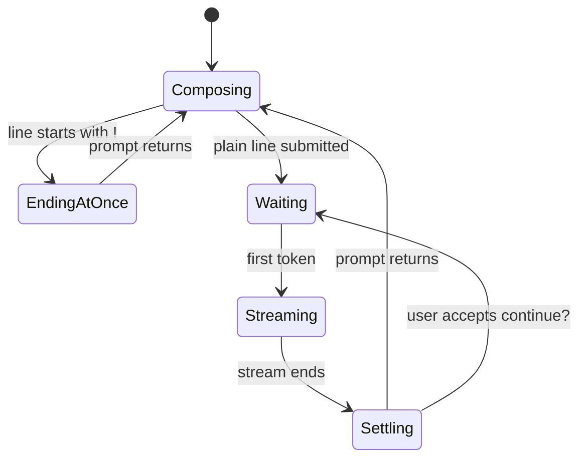

# The session

The shared model of a `transformers chat` session: what exists when it starts, what a turn is, and
what state persists between turns. Feature documents describe the pieces; this document is the
frame they fit into.

## Starting

The user runs `transformers chat <model_id>`, optionally with a server URL and flags (see
[generation settings](../cross-cutting/generation-settings.md)). In order, they see:

1. **The screen clears.** The session claims the visible screen (existing scrollback above it
   survives; see [the terminal medium](the-terminal-medium.md)).
2. **A minimal help card**: the bold title `TRANSFORMERS CHAT INTERFACE` and four bullet
   commands — `!help`, `!status`, `!clear`, `!exit` — as a rendered markdown list.
3. **The model loads.** A progress display runs while the server loads the requested model, then
   is replaced by a one-line italic notice (see [model loading](../session/model-loading.md)).
4. **The prompt.** `<username>:` in bold red, on its own line, cursor below it.

If the server is unreachable, startup fails instead — see
[connection and errors](../session/connection-and-errors.md), including the surprising fact that
the pre-flight health check only happens for the default `localhost:8000` endpoint.

## The conversation

A session holds one **conversation**: an ordered list of messages. If `--system-prompt` was given,
the conversation starts with that instruction; otherwise it starts empty. Every submitted user
line (except commands) appends a user message; every settled reply appends the model's message —
the raw text the model produced, not the styled form on screen. The whole conversation is sent to
the model on every turn, which is what makes it a conversation and not a series of one-shots.

The conversation is memory only. Nothing persists across sessions unless the user runs `!save`
(see [commands](../session/commands.md)); exiting discards everything else.

## The turn

All interaction happens in turns, and every feature document describes its feature against the
turn's five phases:

- **Composing** — the user types at the prompt. Nothing is sent; the conversation is unchanged.
- **Ending at once** — the submitted line is handled locally: commands (`!…`) act immediately and
  return to the prompt without touching the model.
- **Waiting** — a normal line is appended to the conversation and the request goes to the server;
  the reply header `<model_id>:` (bold blue) prints; no tokens have arrived yet.
- **Streaming** — tokens arrive and the reply takes shape on screen
  ([response streaming](../streaming/response-streaming.md)).
- **Settling** — the reply is finalized into scrollback, the [stats line](../streaming/the-stats-line.md)
  may print, the reply joins the conversation, and — if the reply hit the token limit — the
  [continue? flow](../streaming/length-limit-continuation.md) may run. Then the prompt returns.

## State that persists between turns

- **The conversation** (until `!clear`, `!example`, or exit).
- **Generation settings** (until changed by `!set`; never reset by `!clear`).
- **Scrollback** — everything ever printed remains scrollable, including turns "cleared" with
  `!clear`, which resets the conversation and blanks the screen but cannot erase terminal history.

## Ending

The session ends when the user submits `!exit`, and — less gracefully — on Ctrl+C or Ctrl+D, both
of which currently end it with a printed traceback rather than a goodbye
([bug-triage.md](../bug-triage.md) BT-08, BT-09, BT-10). Whatever was printed stays in scrollback;
the conversation is gone unless saved.

## Open questions and verification

Verified against `huggingface/transformers` commit `4b27c4c7915b5672ab4e25349c5c2e209d25956c`
(scripted rig: startup sequence, prompt, turn loop, `!exit`; see `verification/README.md`).

- Whether the startup screen-clear also clears scrollback differs by emulator (it uses the
  clear-screen control, not the clear-history one); not yet hand-checked across emulators.
- The exact appearance when `--system-prompt` is set (identical startup, invisible message) is
  asserted from code and helper tests, not yet watched in the rig.
