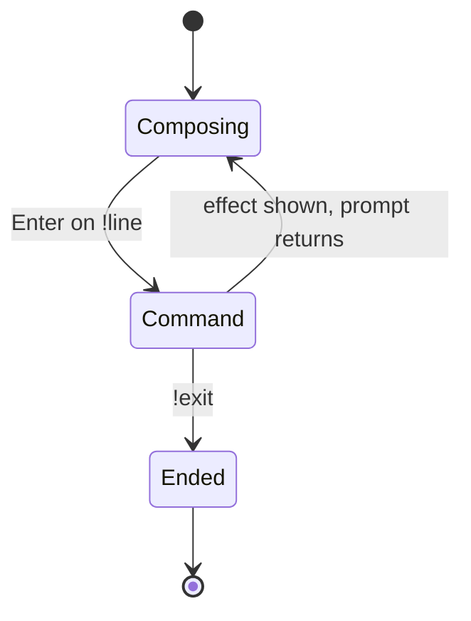

# Commands

## Summary

A line starting with `!` is a command: handled by the session immediately, never sent to the
model, always returning to the prompt. There are seven: `!help`, `!status`, `!clear`, `!save`,
`!set`, `!example`, `!exit`. Anything else starting with `!` prints a red error plus the full
help.

## The simple case

The user types `!status`. The model name and the full table of current generation settings print.
The prompt returns. The conversation is untouched — commands are conversations *about* the
session, not part of it.

## The interaction, event by event

Commands live in the **ending at once** phase: composing captures the line, Enter runs the
command, the prompt returns. With one exception — `!example`, which starts a streaming turn —
none of them contact the server and none of them stream.

What each one does:

- **`!help`** — prints the full command reference as rendered markdown (the startup card is a
  shorter version of it).
- **`!status`** — prints `Model: <model_id>` and the complete current generation settings, as a
  many-line dump of every knob, defaults included. Informative and unedited: expect a screenful.
- **`!clear`** — resets the conversation to its starting state (the system prompt survives, if
  one was given) and clears the visible screen. Earlier turns remain in terminal scrollback —
  cleared from the conversation, not from history (see
  [the terminal medium](../foundations/the-terminal-medium.md)).
- **`!save`** — writes the conversation and settings to
  `./chat_history/<model_id>/chat_<date>_<time>.json` (directories created as needed) and prints
  the path in green. Two rough edges, both real: the help text promises `!save NAME` and a
  `.yaml` file, but a name makes the command unrecognized (red error + help), and the file is
  JSON ([bug-triage.md](../bug-triage.md) BT-13).
- **`!set flag=value …`** — updates generation settings for future turns:
  `!set max_new_tokens=1024 do_sample=False`. Space-separated pairs; numbers, booleans, `None`,
  and integer lists (`eos_token_id=[1,2]`) are understood. A pair missing its `=` prints a red
  format error and the whole line is ignored. See
  [generation settings](../cross-cutting/generation-settings.md).
- **`!example NAME`** — replaces the conversation with a named canned prompt (`!example code`,
  `!example llama`, …), clears the screen, echoes the example as the user's message, and
  immediately streams the model's answer to it — the one command that starts a turn. Unlike
  `!clear`, it resets the conversation to *empty*, silently discarding the system prompt
  (BT-17). An unknown name prints the available names in red — and then, surprisingly, still
  sends a request: the model replies again to whatever the conversation already contained
  (BT-18).
- **`!exit`** — ends the session cleanly. The terminal is left as it stands; nothing is saved.

## Modifiers

| Variant | Set at the start | Changed during the turn |
| --- | --- | --- |
| `--save-folder` | Changes where `!save` writes | Fixed for the session |
| `--examples-path` | Replaces the canned example set | Fixed for the session |
| System prompt | Survives `!clear`; silently lost on `!example` (BT-17) | — |
| Output piped | Command output prints plainly | — |

## Cancel and interrupt

- **Ctrl+C** — commands finish too fast to interrupt; at the prompt the deferred-interrupt trap
  applies as always (BT-09).
- **The user doing something else mid-way** — nothing to do mid-way; commands are atomic.
- **The environment failing** — no command touches the server, so none can fail from it; `!save`
  can fail on an unwritable disk (surfaced as a traceback — BT-11's family).
- **The process going away** — only `!save` leaves anything behind.
- **The input channel changing** — commands read no further input; scripted stdin can drive them
  line by line.

## Interactions with other systems

- **Generation settings** — `!set` writes them, `!status` reads them, `!clear` does *not* reset
  them: settings are session state, not conversation state.
- **Chat history** — `!clear` and `!example` rewrite it; `!save` snapshots it; the rest leave it
  alone. Command lines themselves never enter the conversation.
- **The server and model state** — untouched by every command except `!example` (which sends a
  request), including `!clear` (the model holds no conversation state between requests).
- **Terminal capabilities** — colors (green success, red errors) degrade to plain text.
- **Saved chats** — `!save` writes settings *and* messages, so a saved file reproduces both the
  conversation and the knobs that produced it.

## Edge cases

- Command matching is exact and case-sensitive: `!Help` is an unknown command (error + help).
- `!save` with extra words is unknown (BT-13); `!set` alone sets nothing and prints nothing.
- `!example` with no name, or with two, is an unknown command rather than a usage hint.
- A second command handler exists in the code but is never called; it drifts from the real one
  (its `!save NAME` works, for instance) and misleads readers of the code (BT-16).

## Open questions and verification

Verified against `huggingface/transformers` commit `4b27c4c7915b5672ab4e25349c5c2e209d25956c`:
`!exit` in the scripted rig; `!save` path shape and history reset from `tests/cli/test_chat.py`;
the rest from code, pending checklist `verification/session-and-commands.md` SC-06..SC-12.

- The `!example` fall-through on an unknown name (BT-18) is asserted from control flow; the rig
  should watch what a request with an empty conversation does at the server (SC-10).
- Whether `!set` accepts unknown flag names silently (storing them and sending them to the
  server) is unverified (SC-09).
