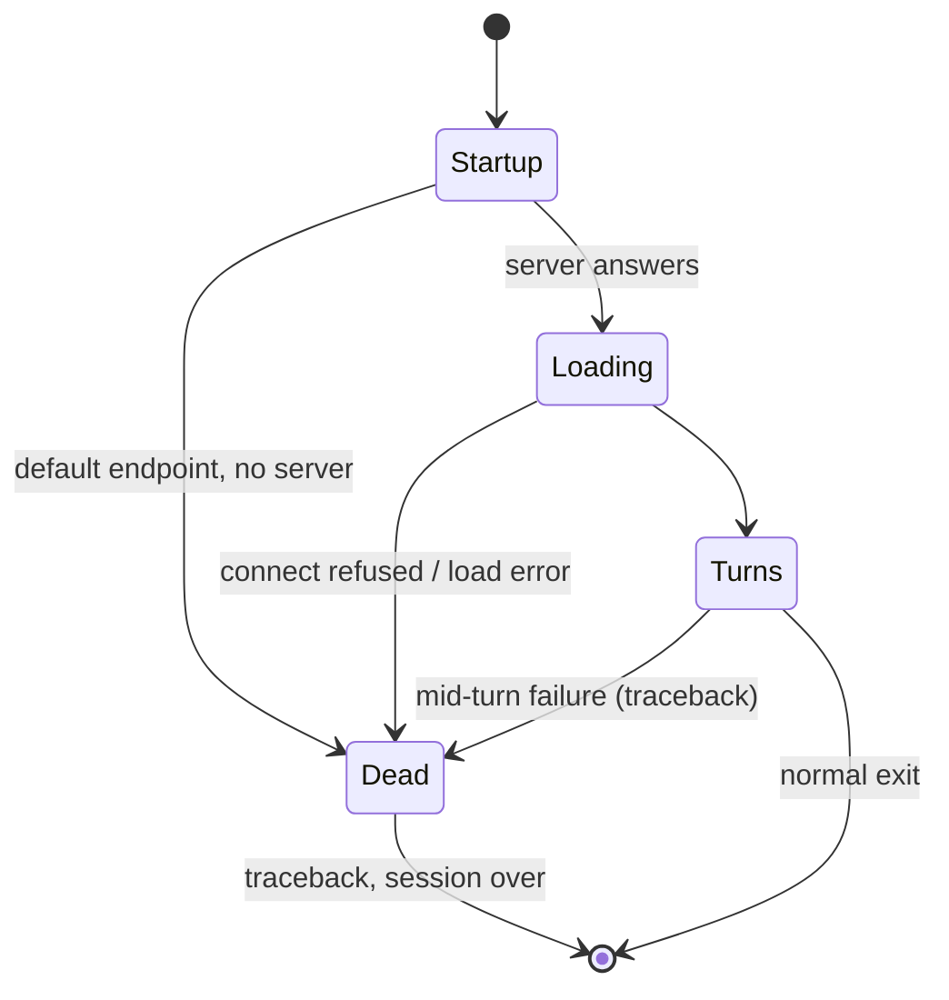

# Connection and errors

## Summary

The session talks to one server for everything. When the server is missing, refuses, or dies, the
user finds out at one of three moments — startup, model load, or mid-turn — and today, in every
one of them, the news arrives as a Python traceback rather than a message. The most helpful text
the product has ("please run `transformers serve`…") exists, but is printed inside a traceback.

## The simple case

There isn't one; this document is the unhappy paths. The closest thing: the user starts
`transformers chat <model>` with no server running on the default `localhost:8000`, and the
session ends immediately with a traceback whose last line contains the genuinely useful
instruction: `No server currently running on http://localhost:8000. To run a local server, please
run 'transformers serve' in a separate shell.`

## The interaction, event by event

Failures attach to phases rather than having their own:

- **Startup (before any turn)** — *only when the endpoint is the default `localhost:8000`*, the
  session pre-flight-checks the server and stops with the message above if it is missing or
  unhealthy. A custom `base_url` skips the check entirely — surprising, and it means a wrong URL
  is discovered one step later, as a connection-refused traceback during
  [model loading](model-loading.md).
- **Waiting** — a server that accepts the connection but never streams leaves the reply header
  alone on screen indefinitely; there is no timeout and no spinner. The user's only tool is
  Ctrl+C, with its known cost ([bug-triage.md](../bug-triage.md) BT-08).
- **Streaming** — a connection that drops mid-reply settles the display first — everything
  streamed so far is committed and readable — and then prints the failure as a traceback
  (BT-11). The partial reply *is* recorded in the conversation only if the failure surfaces as
  the stream ending; a hard exception ends the session, so in practice the conversation dies with
  it.
- **Settling** — no failure modes of its own.

## Modifiers

| Variant | Set at the start | Changed during the turn |
| --- | --- | --- |
| Default endpoint (`localhost:8000`) | Health-checked at startup: fast, clear failure | Server dying later → mid-turn traceback |
| Custom `base_url` | No health check; failures surface late | Same |
| Server behind a proxy path (`https://…/proxy/v1`) | Supported; management calls go to the same root | — |
| Output piped | Tracebacks land in the pipe | — |

## Cancel and interrupt

- **Ctrl+C** — the user's own exit from a hang; ends the session with the usual traceback
  (BT-08).
- **The user doing something else mid-way** — a second session in another terminal can load a
  different model on the same server; the first session's next turn then pays the model-switch
  cost (or fails), with nothing on screen explaining why (see Open questions).
- **The environment failing** — the subject of this document.
- **The process going away** — killing the *server* mid-turn is the "streaming" case above;
  killing the chat process leaves the server unbothered.
- **The input channel changing** — no interaction: failures print the same piped or not.

## Interactions with other systems

- **Generation settings** — a malformed setting accepted by `!set` can make the *server* reject
  the next request; the rejection is a mid-turn traceback here (SC-09 checks what exactly).
- **Chat history** — a session ended by a failure takes its unsaved conversation with it; `!save`
  beforehand is the only protection.
- **The server and model state** — the health check tells the user the server exists, not that
  the model is loadable; those failures come later, during load.
- **Terminal capabilities** — tracebacks are plain text everywhere.
- **Saved chats** — unaffected by connection failures once written.

## Edge cases

- The default-endpoint health check runs even when the user explicitly passed
  `http://localhost:8000` — the check keys on the address, not on whether it was defaulted.
- A server that answers the health check but 404s the chat API (wrong service on the port) fails
  mid-first-turn with an HTTP error traceback.
- IPv6 (`http://[::1]:8000`) is a custom endpoint: no health check.

## Open questions and verification

Verified against `huggingface/transformers` commit `4b27c4c7915b5672ab4e25349c5c2e209d25956c`
(the custom-endpoint no-health-check path and mid-stream settle-then-fail are exercised by the
scripted rig; the default-endpoint refusal message is asserted from code and its error string).

- What the user sees when another session switches the server's loaded model between turns
  (silent reload delay? error?) is unverified (SC-15).
- Whether any HTTP timeout applies to the hung-waiting case on some stacks (proxy, TLS) is
  unverified; none is configured in the product itself.
