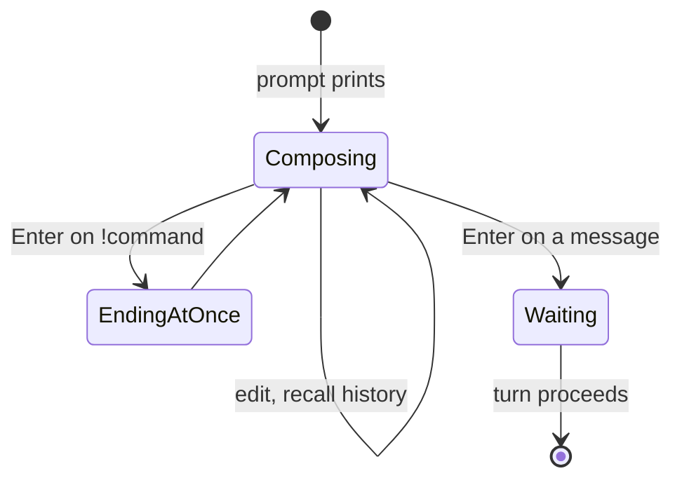

# Input and the prompt

## Summary

The prompt is a bold red `<username>:` on its own line; the user types below it and Enter submits.
Typing has shell-like comforts — cursor movement, editing, and arrow-up recall of earlier inputs
from this session. What is submitted is either a command (handled at once) or a message (sent to
the model).

## The simple case

The prompt appears. The user types a question, fixes a word with the arrow keys, presses Enter. A
blank line opens, the reply header prints, and the turn proceeds. At the next prompt, arrow-up
brings the previous question back for editing.

## The interaction, event by event

- **Composing** — begins when the prompt prints. Keystrokes echo; nothing leaves the machine. The
  username is the OS login name unless `--user` overrode it at launch. What is captured on Enter
  is the line exactly as typed, with surrounding behavior:
  - **ending at once** — a line starting with `!` is a command: handled locally, prompt returns
    ([commands](commands.md)). An unrecognized `!word` prints a red error and the full help.
  - an **empty line** is *not* ignored: it is sent to the model as an empty message and streams
    whatever the model makes of that (surprising — [bug-triage.md](../bug-triage.md) BT-15).
- **Waiting / streaming / settling** — the submitted message's turn; described in
  [response streaming](../streaming/response-streaming.md). During those phases there is no
  prompt; typing is not buffered as the next input in any dependable way.

## Modifiers

| Variant | Set at the start | Changed during the turn |
| --- | --- | --- |
| `--user NAME` | Prompt reads `<NAME>:` | Not changeable mid-session |
| System prompt | Invisible at the prompt | — |
| Terminal width | Long input wraps and stays editable | Resize while typing: the emulator re-flows the input line, occasionally raggedly (emulator-dependent) |
| Output piped / not a terminal | The prompt text still prints; input is read from stdin lines | — |

## Cancel and interrupt

- **Ctrl+C** — at the prompt, *appears to do nothing*: the session keeps accepting keystrokes.
  The interrupt is deferred, and the next Enter — instead of sending the message — ends the whole
  session with a traceback, discarding what was typed. Verified, and genuinely a trap
  ([bug-triage.md](../bug-triage.md) BT-09).
- **The user doing something else mid-way** — scrolling while composing is free; the prompt stays
  put. Pasting multi-line text submits the first line; remaining lines feed subsequent prompts
  (see Open questions).
- **The environment failing** — the server is not involved while composing; a dead server is
  discovered only after submitting.
- **The process going away** — closing the terminal discards the conversation; nothing typed is
  preserved anywhere.
- **The input channel changing** — Ctrl+D at the prompt ends the session with an `EOFError`
  traceback rather than a goodbye (BT-10). When stdin is a pipe, each line is consumed as one
  input; end of file behaves like Ctrl+D.

> Technical note: the Ctrl+C trap is Python's asyncio runner intercepting SIGINT while the session
> is blocked in synchronous `input()`: the interrupt is converted into a task cancellation that
> can only land at the next `await` — which is the send triggered by Enter. The session's own
> `except KeyboardInterrupt` never sees it.

## Interactions with other systems

- **Generation settings** — none while composing; `!set` lines are themselves input.
- **Chat history** — submitted messages join the conversation verbatim; input-line recall
  (arrow-up) is separate, in-session-only, and includes commands.
- **The server and model state** — untouched until Enter.
- **Terminal capabilities** — editing and recall need a real terminal; a dumb pipe still works,
  minus the comforts.
- **Saved chats** — record submitted messages, not keystrokes or recalled-but-unsent lines.

## Edge cases

- After every submission a blank line prints before the turn proceeds, giving the transcript its
  rhythm of `prompt / message / blank / reply`.
- The prompt renders even when output is piped, so a scripted session's output file begins each
  turn with `<username>:`.
- A line of only spaces is sent as a message of only spaces, like BT-15's empty line.

## Open questions and verification

Verified against `huggingface/transformers` commit `4b27c4c7915b5672ab4e25349c5c2e209d25956c`
(scripted rig: prompt appearance, echo and submit, Ctrl+C deferred trap, Ctrl+D traceback —
checklist `verification/session-and-commands.md` SC-01..SC-05).

- Multi-line paste handling (queued lines vs. dropped) is asserted from line-buffered stdin
  behavior, not yet watched in the rig.
- Whether arrow-up recall persists any history file across sessions on some platforms (readline
  defaults) is unchecked; observed in-session only.
