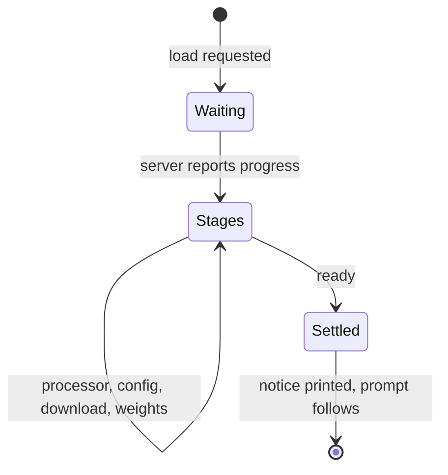

# Model loading

## Summary

Between the help card and the first prompt, the session asks the server to load the requested
model and shows a live progress display while it does: a stage label, a progress bar, counts or
byte sizes with speed and ETA for downloads, and elapsed time. When loading finishes the display
vanishes and a single italic line remains: `<model> was already loaded.` or `<model> is warm.`

## The simple case

The user starts `transformers chat Qwen/Qwen3-4B` against a warm server. A progress line flashes
through its stages in under a second, disappears, and `Qwen/Qwen3-4B was already loaded.` sits
above the first prompt. On a cold server with an undownloaded model, the same display lives for
minutes, most of it in the download stage with sizes (`1.2 GB/8.0 GB  45 MB/s  2:31`) counting
up.

## The interaction, event by event

Model loading is part of session startup, not of a turn; the phase vocabulary still maps:

- **Composing / ending at once** — none; the user only watches.
- **Waiting** — the request to load is sent; the display appears immediately with its first stage
  label and an indeterminate bar.
- **Streaming** — the server reports stages — loading processor, loading config, downloading
  files, loading into memory — and per-stage progress; the display repaints in place (a live
  region: nothing enters scrollback while it runs). Download progress shows bytes, speed, ETA;
  other stages show item counts.
- **Settling** — the display is erased (it leaves no trace in scrollback) and the italic notice
  prints in its place: `was already loaded` if the server had it warm, `is warm` if it just
  became so. Then the prompt.

## Modifiers

| Variant | Set at the start | Changed during the turn |
| --- | --- | --- |
| Terminal width | Wide terminals prefix the stage with the model name (`model → Downloading files`); narrow ones show the stage alone | Resize mid-load: prefix decision was made at start; bar re-flows |
| Server cache state | Warm: sub-second flash. Cold: minutes in the download stage | — |
| Output piped | No live display; the notice still prints | — |

## Cancel and interrupt

- **Ctrl+C** — during loading, ends the session with a traceback (the load request is abandoned;
  the server may keep loading — [bug-triage.md](../bug-triage.md) BT-08's family).
- **The user doing something else mid-way** — scrolling up during a long download works; the
  display stays put at the bottom. Nothing else accepts input yet.
- **The environment failing** — a server error during load surfaces as a `RuntimeError` traceback
  with the server's message inside it (BT-11); an unreachable server is
  [connection and errors](connection-and-errors.md)' territory.
- **The process going away** — closing the terminal abandons the wait; the server continues or
  not on its own.
- **The input channel changing** — stdin is not read during loading; Ctrl+D queues for the first
  prompt.

## Interactions with other systems

- **Generation settings** — uninvolved; loading is about the model, not the knobs.
- **Chat history** — none exists yet.
- **The server and model state** — the one place the session manages the server rather than just
  talking to it: the session *requests* the load; the server owns caching and eviction. A second
  session for the same model finds it warm.
- **Terminal capabilities** — the bar degrades to plain text without color; the transient erase
  needs a real terminal.
- **Saved chats** — uninvolved.

## Edge cases

- The italic wording is odd on first meeting: `was already loaded.` (cached) vs `is warm.`
  (freshly loaded) — reversed from what the words suggest to some readers; noted, not filed, as
  wording.
- The display is the second of the product's two live regions; it obeys the same physics as the
  streaming tail ([the terminal medium](../foundations/the-terminal-medium.md)).
- A model name longer than the terminal is wide drops the name prefix entirely rather than
  truncating it.

## Open questions and verification

Verified against `huggingface/transformers` commit `4b27c4c7915b5672ab4e25349c5c2e209d25956c`
(scripted rig: warm path — stage flash, transient erase, `was already loaded.` notice; checklist
`verification/session-and-commands.md` SC-13).

- The cold path (real download with byte counts, speed, ETA) has only been read, not watched
  (SC-14, needs a real server and an undownloaded model).
- What the server does with an abandoned load (Ctrl+C mid-download) is a server-side question,
  out of scope here but worth an answer somewhere.
