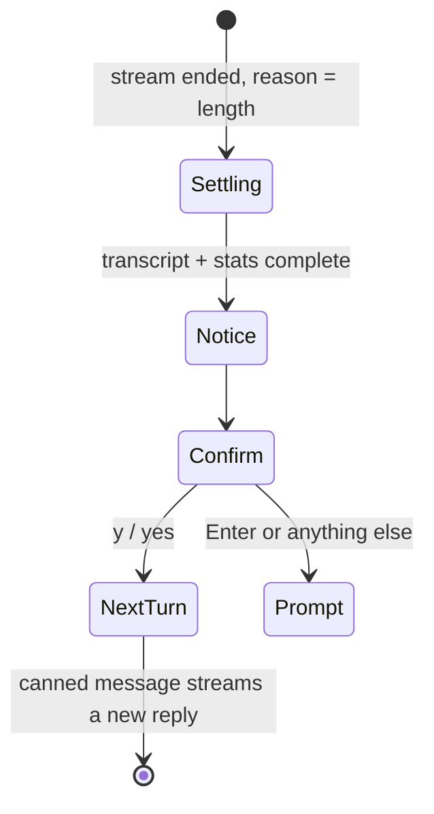

# Length-limit continuation

## Summary

When a reply stops because it hit the token limit rather than because the model finished, the
session says so — `Generation stopped after reaching the token limit.` in yellow — and offers to
continue: `Continue generating? (y/N):`. Accepting sends a canned "please continue" message as if
the user had typed it, and the next reply picks up where the last one stopped.

## The simple case

With the default limit of 256 new tokens, the user asks for something long. The reply streams,
settles mid-thought, the stats line prints, then the yellow notice and the question. The user
presses `y` and Enter; `<username>:` echoes `Please continue. Do not repeat text.”` as a normal
user message, and a new turn streams the continuation. Pressing Enter alone (the default is No)
returns to the prompt with the reply left as it stopped.

## The interaction, event by event

- **Composing / ending at once / waiting / streaming** — a normal turn; nothing here differs
  until the stream's final chunk carries the reason it stopped.
- **Settling** — the reply settles fully (committed transcript, stats line, history) *before* the
  notice appears: this flow is an appendix to settling, not a replacement. Then:
  - the yellow notice prints;
  - the confirm question prints and waits, its own miniature composing phase (`y`/`yes` in any
    case accepts; anything else, or just Enter, declines);
  - on accept, the canned message is echoed as the next user message and a fresh turn begins at
    its waiting phase — the user never types it;
  - on decline, the prompt returns.

## Modifiers

| Variant | Set at the start | Changed during the turn |
| --- | --- | --- |
| `max_new_tokens` (default 256) | Decides how often this flow appears at all | `!set` next turn; a larger limit makes the flow rare |
| System prompt | May change how well the model resumes | — |
| Terminal width | Notice and question wrap like any text | — |
| Output piped | The question still waits on stdin; a closed stdin ends the session | — |

## Cancel and interrupt

- **Ctrl+C** — at the confirm question it is absorbed silently and the session dies on the next
  Enter, the same trap as at the prompt ([bug-triage.md](../bug-triage.md) BT-09).
- **The user doing something else mid-way** — scrolling while the question waits is fine; the
  question stays at the bottom. Typing anything other than an accepting answer declines.
- **The environment failing** — a server failure during the *continuation* turn behaves like any
  mid-stream failure; the accepted flow is not retried.
- **The process going away** — closing the terminal at the question loses the (already settled)
  reply like any unsaved conversation.
- **The input channel changing** — Ctrl+D at the question ends the session with the same
  traceback as at the prompt (BT-10).

## Interactions with other systems

- **Generation settings** — the continuation turn uses the current settings; it also counts
  against `max_new_tokens` itself, so very long answers ask again, each time.
- **Chat history** — both the truncated reply and the canned user message enter the conversation;
  a later `!save` records the seam exactly as it happened.
- **The server and model state** — "stopped for length" is the server's verdict, reported with
  the final chunk; the client adds no heuristics.
- **Terminal capabilities** — yellow notice degrades to plain text where color is unavailable.
- **Saved chats** — see chat history: the canned message is saved as a genuine user turn.

## Edge cases

- The canned message ends with a stray typographic quote — `Do not repeat text.”` — visible in the
  echo and stored in history (BT-14).
- The model may repeat itself anyway; the flow re-offers after every length-stopped reply, so a
  looping model can be continued indefinitely, one `y` at a time.
- A reply that hits the limit *exactly* at a natural ending still shows the notice: the check is
  the stop reason, not the prose.

## Open questions and verification

Verified against `huggingface/transformers` commit `4b27c4c7915b5672ab4e25349c5c2e209d25956c` by
reading `chat.py` and the stop-reason handling; the full flow has not yet been exercised in the
scripted rig (`verification/streaming-output.md` SO-12, priority P2 — the stub server can emit
`finish_reason: "length"` to drive it).

- Whether the confirm question's answer is added to input history (arrow-up recall) is unchecked.
