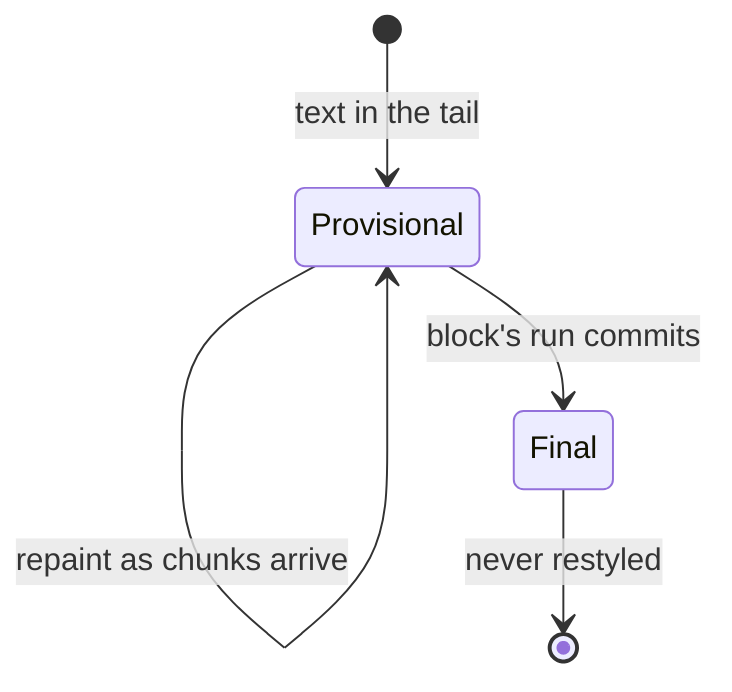

# Markdown rendering

## Summary

Everything the model says is treated as markdown and rendered with structure: headings, bold and
italic, syntax-colored code blocks on a dark background, bulleted and numbered lists, tables,
quotes, links. Two chat-specific adjustments are applied to the model's text before rendering: a
single newline in prose really starts a new line (models mean it that way), and bare single-word
tags like `<think>` are shown literally instead of vanishing as HTML.

## The simple case

The model writes `**Yes.** Here's how:` followed by a fenced code block. The user sees "**Yes.**
Here's how:" with real bold, then the code with syntax colors on a dark block, at full terminal
width. What the model wrote and what the user reads correspond line for line.

## The interaction, event by event

Rendering has no phases of its own; it is the lens the streaming phases are seen through. What is
worth pinning down is *when* text is rendered in which form:

- **Waiting** — nothing to render.
- **Streaming** — the tail re-renders from source on every repaint, so formatting is provisional
  until its block completes: a line beginning `**bold` shows literal asterisks until the closing
  `**` arrives, a table shows as pipe-characters until its separator row arrives, a fence opener
  colors everything below it as code until it closes. Watching structure snap into place is the
  characteristic look of streaming markdown.
- **Settling** — committed output is final: rendered once, from a completed block, and never
  restyled afterward.

The two adjustments, precisely:

- **Hard breaks.** Outside code, every completed prose line is treated as ending a line on screen.
  Standard markdown would fuse `line one\nline two` into one paragraph line; chat models emit
  single newlines meaning "new line", so the display honors them.
- **Tag escaping.** Outside code, a single word in angle brackets — `<think>`, `</think>` — is
  escaped so it appears literally. Unescaped, markdown would treat it as an HTML tag and silently
  drop it, which for reasoning models means silently dropping the visible seams of their thinking.
  Multi-word forms (`<not a tag, has spaces>`) are left alone.

> Technical note: both adjustments are applied per source line, tracking fence state, in
> `chat_display.py` (`escape_tags`, `hard_break`). Before the rework they were applied to every
> raw chunk, which corrupted code blocks containing `
` and missed tags split across chunk
> boundaries — BT-06, BT-07 in [bug-triage.md](../bug-triage.md).

## Modifiers

| Variant | Set at the start | Changed during the turn |
| --- | --- | --- |
| Terminal width | Prose wraps to it; code blocks span it | Resize: tail re-wraps, committed lines keep their wrap |
| Terminal color depth | Full syntax theme → reduced palette → plain | Applies to whatever renders next |
| Output piped | Structure without color: indents, bullets, plain code | — |
| Code block theme | Always the dark `github-dark` theme, even on light terminals | Not changeable in the product today |

## Cancel and interrupt

- **Ctrl+C** — whatever was streamed renders in its committed form before the session ends
  (an unclosed fence renders as a code block missing its bottom, exactly as the model left it).
- **The user doing something else mid-way** — scrolling and resizing as in
  [response streaming](response-streaming.md); rendering itself has no interaction points.
- **The environment failing** — a failed stream leaves the partial reply rendered as far as the
  text got; no unstyled residue.
- **The process going away** — rendering is stateless; nothing to clean up.
- **The input channel changing** — piped output renders structure without live provisional
  states.

## Interactions with other systems

- **Generation settings** — none; rendering is the same at any temperature.
- **Chat history** — the conversation stores the model's raw text; escaping and hard breaks are
  display-only and are not written into history or saved chats (post-rework; BT-05).
- **The server and model state** — none beyond the text itself.
- **Terminal capabilities** — the dark code background on a light terminal is legible but visibly
  a dark slab; hyperlinks render as underlined text, clickable where the emulator supports them.
- **Saved chats** — store source text, so a saved chat re-renders identically in a future session.

## Edge cases

- **`<think>` inside inline code** — `` `<think>` `` is escaped anyway (the escape is line-level)
  and shows a stray backslash inside the backticks. Cosmetic, rare, open as BT-12.
- **Indented (four-space) code blocks** — still receive tag escaping and hard-break spaces, since
  only fences suppress the adjustments; a `
` in indented code gains backslashes (BT-12).
  Models overwhelmingly use fences.
- **Tables mid-stream** — a table renders as plain `| a | b |` text until its `|---|` separator
  row arrives, then snaps into a ruled table; its column widths keep adjusting as rows stream,
  which is why a table never commits until it ends.
- **Numbered lists renumber** — a list reaching item 10 re-indents items 1–9 to align the wider
  numbers; the user can watch the whole list shift once. This is also why lists commit only when
  a non-list block follows.
- **A lone `---`** after a blank line is a horizontal rule; directly under a text line it turns
  that line into a heading (setext) — both stream correctly because adjacent lines always share a
  run.

## Open questions and verification

Verified against `huggingface/transformers` commit `4b27c4c7915b5672ab4e25349c5c2e209d25956c`
(fidelity suite in `tests/cli/test_chat_display.py` covers every element listed here at four chunk
sizes; fence-awareness of the adjustments has dedicated tests; checklist
`verification/streaming-output.md` SO-06..SO-09).

- Whether any popular reasoning model emits tag forms the single-word escape misses (attributes,
  hyphens) has not been surveyed.
- The dark-on-light legibility judgment is an opinion pending the emulator hand pass.
