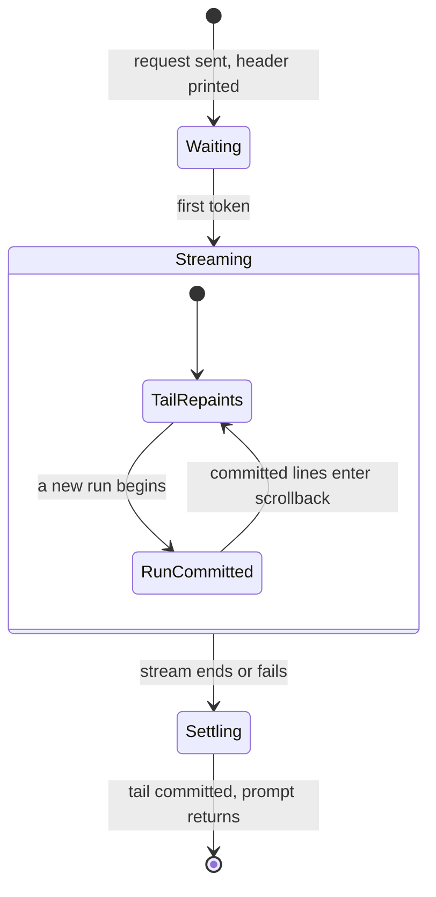

# Response streaming

## Summary

A reply arrives token by token and builds up on screen as formatted markdown. Finished parts of
the reply are printed permanently, exactly once, into the terminal's normal scrollback; only the
part still taking shape — the current paragraph, code block, list, or table — repaints, in a
bounded area at the bottom of the screen that always shows its newest lines. The result is that
the generation point is always visible no matter how long the reply grows, the user can scroll up
through the reply while it is still streaming, and when the reply settles, the transcript in the
terminal is identical to what printing the finished message in one go would have produced.

## The simple case

The user submits a question. `<model_id>:` prints in bold blue. A beat later words start appearing
below it, restyling live from plain text into formatted markdown as their structure becomes clear.
When the reply outgrows the screen, the terminal scrolls naturally — like watching `cat` print a
long file — with the newest words always at the bottom. The reply ends; a dim
[stats line](the-stats-line.md) prints; the prompt returns. Scrolling up at any point, during or
after, walks back through the whole reply.

## The interaction, event by event

- **Composing / ending at once** — not involved; command turns never stream.

- **Waiting** — the header `<model_id>:` prints as an ordinary line (it is scrollback immediately,
  not part of any live area). The screen then holds still until the first token; there is no
  spinner. A slow model is indistinguishable from a stalled one during this phase (see
  [connection and errors](../session/connection-and-errors.md)).

- **Streaming** — the moment decided here: each arriving chunk joins the reply's accumulated text,
  and the display splits that text into **blocks** at blank lines, grouping into **runs** the
  blocks that later text could still change (an unclosed code fence; a list that the next chunk
  may extend and renumber; adjacent indented code). Two things then happen continuously:

  - **Commit.** The moment a new run begins, the finished run before it is rendered once and
    printed above the live region as ordinary lines — permanent, never repainted, immediately part
    of scrollback with one blank line between runs.
  - **Follow.** The current run — the **tail** — repaints in the live region up to eight times a
    second as its text grows and its formatting resolves. If the tail is taller than the window
    budget (screen height minus six rows, at least four), the region shows the tail's *newest*
    lines, with a dim `…` on its top row meaning "this block continues above and will print in
    full when it commits". The newest tokens are therefore always on screen — the terminal analog
    of a chat window sticking to its bottom edge.

  A reply of many short blocks streams as a steady trickle of committed lines with a small,
  quiet tail; a reply that is one enormous code block streams entirely inside the live region,
  newest lines visible, and commits all at once when the fence closes.

- **Settling** — the live region is erased and the remaining tail is printed permanently in its
  place, completing the transcript. Because commits happen only at safe boundaries, the finished
  transcript is byte-for-byte what a one-shot render of the whole message would have printed (the
  render-fidelity test suite asserts exactly this, across chunk sizes). Then the stats line, the
  conversation records the raw reply text, and the prompt returns.



> Technical note: the design is the terminal counterpart of how streaming web renderers handle
> oversized content — cf. Streamdown 2.6.0's `codeBlockMaxHeight`/`tableMaxHeight` with streaming
> auto-scroll: bound the volatile region, auto-follow its newest content, release the rest to the
> page. Here "the page" is terminal scrollback, which brings free scroll-up-during-streaming. The
> commit rule exists because markdown is not prefix-stable: a list gaining a tenth item re-indents
> items one through nine, so a list is only committable once a non-list block follows it.
> Implementation: `MarkdownStream` in `src/transformers/cli/chat_display.py`.

## Modifiers

| Variant | Set at the start | Changed during the turn |
| --- | --- | --- |
| Terminal height | Sets the window budget for the tail | Resize: tail repaints to the new budget on the next refresh |
| Terminal width | Everything wraps to it | Resize: already-committed lines keep the old wrap (emulator may re-flow them); the tail and later commits use the new width |
| `!set max_new_tokens=…` | Bounds how long streaming can run before the [limit flow](length-limit-continuation.md) | Next turn only |
| System prompt | Invisible here; changes only what the model says | — |
| Output piped (not a terminal) | No live region at all: runs print as they commit, the rest at the end, plain | — |

## Cancel and interrupt

- **Ctrl+C** — mid-stream, generation stops and everything streamed so far — including the tail —
  is committed to scrollback before the session ends… with an ugly multi-screen traceback, because
  the interrupt escapes the session loop instead of being handled
  ([bug-triage.md](../bug-triage.md) BT-08). The partial reply is preserved; the session is not.
- **The user doing something else mid-way** — typing during streaming: characters echo at the
  bottom and are *not* consumed as the next prompt's input in any useful way; they interleave
  visually with the live region. Scrolling up: committed lines are ordinary scrollback, so the
  viewport stays pinned where the user puts it while new commits accumulate below; the live region
  itself stays on the physical screen area (see
  [the terminal medium](../foundations/the-terminal-medium.md)). Resizing: as in Modifiers.
- **The environment failing** — if the connection drops or the server errors mid-stream, the
  display settles first (the partial reply is committed and readable), then the failure surfaces
  as an error, currently a traceback (BT-11).
- **The process going away** — closing the terminal kills the session; whatever was already
  committed existed only in that window's scrollback and dies with it. Nothing is written to disk
  during streaming.
- **The input channel changing** — Ctrl+D matters only at the prompt. When output is piped, the
  same content arrives in the same order, without the live region; an interrupted pipe leaves the
  committed prefix.

## Interactions with other systems

- **Generation settings** — `max_new_tokens` (default 256) decides how often streaming ends in the
  limit flow rather than naturally; sampling settings change pace, not display behavior.
- **Chat history** — the conversation records the model's raw text, not the rendered form; what
  `!save` writes is what the model said, unstyled (this was not true before the rework — BT-05).
- **The server and model state** — chunk pacing is entirely server-side; the display imposes no
  minimum rate and coalesces bursts into at most ~8 repaints a second.
- **Terminal capabilities** — colors degrade with the terminal; the `…` marker and dim styling
  render as plain characters where styling is unavailable.
- **Saved chats** — a `!save` after the turn stores the reply text; nothing about scrolling or
  layout is persisted.

## Edge cases

- **A reply with no blank lines** (one giant paragraph or list) never commits mid-stream: it
  streams entirely in the live region, newest lines visible above the `…` marker, scrollback
  untouched until settling. Scroll-up during such a reply shows only pre-reply history — the
  bounded-region tradeoff, chosen over the alternative of never seeing the newest lines.
- **The first screenful** — until the reply outgrows the window budget, the whole tail fits and
  there is no `…` marker; short replies never show one.
- **Blank-edge trimming** — leading and trailing blank lines of the reply are not printed; the
  reply body starts directly under the header. (A one-shot render of a reply *starting* with a
  list would print a stray blank first — the streamed form is deliberately cleaner; the fidelity
  tests normalize for it.)
- **A partial line at the end of a chunk** repaints as ordinary text until its newline arrives;
  a markdown marker split across chunks (` ``` ` arriving as ` `` ` + ` ` `) may render literally
  for a fraction of a second and correct itself — visible only at very slow token rates.
- **Reference-style links** (`[1]: https://…` defined after use) cannot apply to already-committed
  lines; the definition renders as its own block. Chat models essentially never emit these.
- **Very long single lines** wrap into many rows; a single source line taller than the window
  budget follows the same newest-lines rule.

## Open questions and verification

Verified against `huggingface/transformers` commit `4b27c4c7915b5672ab4e25349c5c2e209d25956c`:
render-fidelity suite and pty test in `tests/cli/test_chat_display.py`, plus the scripted 24×80
rig for the full app (checklist `verification/streaming-output.md`, items SO-01..SO-09). Measured
there: a 50-line reply that froze at 23 lines + `...` pre-rework streams completely post-rework,
and terminal write volume for the same reply dropped from ~368 KB to ~40 KB.

- The exact feel of the settle (live region erase and reprint in the same instant) has been
  verified in emulation; whether any emulator shows it as a flicker needs the hand pass (SO-13).
- Behavior when the server streams faster than the terminal can accept bytes (backpressure) is
  untested.
