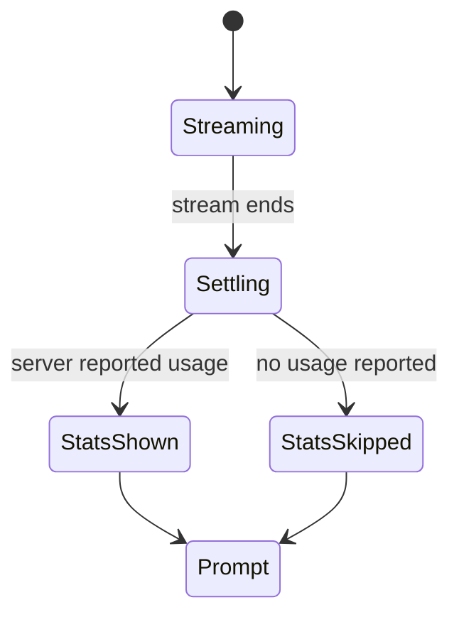

# The stats line

## Summary

After a reply finishes streaming, a dim one-line summary reports how many tokens arrived and how
fast — `42 tokens in 3.3s (12.6 tok/s)` — separated from the reply by one blank line. It is the
quiet receipt for the turn: easy to ignore, there when the user wonders whether the model is slow
or the server is.

## The simple case

The user submits a message. The reply streams and settles. One blank line, then the stats line in
dim text, then another blank line, then the prompt returns. The numbers mean: how many tokens the
server says it generated, wall-clock time from sending the request to the last token, and their
ratio.

## The interaction, event by event

The stats line is part of every normal turn; its life is confined to the last two phases.

- **Composing / ending at once** — no involvement. Turns that end at once (commands) never show a
  stats line.
- **Waiting** — the clock that will appear in the line starts when the request is sent, so time
  waiting for the first token is included in the total (see Edge cases).
- **Streaming** — nothing visible. The token count updates silently as the server reports usage;
  the user cannot see a partial count.
- **Settling** — after the reply is committed to scrollback and the live region is gone, the line
  prints if — and only if — the server reported a token count. Then the prompt returns.

## Modifiers

| Variant | Set at the start | Changed during the turn |
| --- | --- | --- |
| Server reports usage | Line appears | Usage arrives with any chunk; only the last value counts |
| Server reports no usage | Line silently absent (one blank line still separates reply and prompt) | — |
| `!set max_new_tokens=…` | Changes how large the count can get | Takes effect next turn, not this one |
| Terminal width | Line is short and never wraps in practice | Resize mid-turn: prints at the new width |
| Output piped (not a terminal) | Line prints as plain text, no dimming | — |

## Cancel and interrupt

- **Ctrl+C** — mid-stream, the session crashes before settling; no stats line is printed
  ([bug-triage.md](../bug-triage.md) BT-08).
- **The user doing something else mid-way** — typing during streaming does not affect the line;
  scrolling up before it prints leaves it waiting in unread output below; resizing changes only
  the width it wraps to.
- **The environment failing** — if the connection drops mid-stream, the error interrupts the turn
  before settling and no stats line prints.
- **The process going away** — nothing to preserve; the line is stateless.
- **The input channel changing** — with output piped, the line prints undimmed; Ctrl+D happens at
  the prompt, where no stats line is pending.

## Interactions with other systems

- **Generation settings** — `max_new_tokens` caps the count; sampling settings change timing and
  therefore tok/s. The line reports, never influences.
- **Chat history** — the line is not part of the conversation and is never saved by `!save`.
- **The server and model state** — the count is the server's number, not a client-side count of
  chunks; a server that reports nothing suppresses the line entirely.
- **Terminal capabilities** — "dim" rendering depends on the emulator; some render it as gray,
  some as normal text.
- **Saved chats** — absent, by design: the file stores the conversation, not the receipts.

## Edge cases

- The elapsed time starts when the request is sent, so a model with a long first-token delay shows
  a lower tok/s than its steady-state speed. Surprising if you are benchmarking; honest if you are
  waiting.
- A reply interrupted by the token limit still settles normally, so the stats line prints before
  the [continue? prompt](length-limit-continuation.md) appears.
- An empty reply (stream ends with no tokens) prints no stats line — just the blank line and the
  prompt.

## Open questions and verification

Verified against `huggingface/transformers` commit `4b27c4c7915b5672ab4e25349c5c2e209d25956c`
(scripted rig, checklist `verification/streaming-output.md` items SO-10..SO-11: observed
`42 tokens in 3.3s (12.6 tok/s)` after a 40-row reply).

- Whether any deployed `transformers serve` version omits usage in practice (making the silent
  absence common) has not been surveyed.
